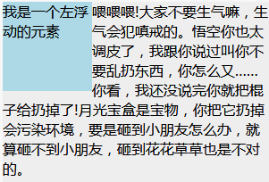
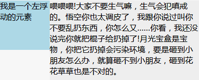

## BFC及其应用

### 1. 什么是BFC
BFC，"块级格式化上下文"。是页面盒模型布局中的一种 CSS 渲染模式，相当于一个独立的容器，里面的元素和外部的元素相互不影响。

### 2. 如何创建BFC
1. 根元素`<html>`
2. 浮动（元素的 `float` 不是 `none`）
3. 绝对定位（元素的 `position` 为 `absolute` 或 `fixed`）
4. `overflow` 不为 `visiable` 的块元素
5. display 为表格布局、弹性布局、网格元素或者行内块元素
6. ...[更多创建BFC方式 (MDN)](https://developer.mozilla.org/zh-CN/docs/Web/Guide/CSS/Block_formatting_context)

### 3. BFC布局规则
1. 内部的box会在垂直方向，一个接一个放置（即块级元素独占一行）
2. BFC的区域不会与float box重叠（利用这点可以实现自适应两栏布局）
3. 内部的Box垂直方向的距离由 `margin` 决定。属于同一个BFC的两个相邻Box的 `margin` 会发生重叠( `margin` 重叠三个条件：**同属于一个BFC；相邻；块级元素**)
4. 计算BFC的高度时，浮动元素也参与计算（清除浮动）
5. BFC就是页面上的一个隔离的独立容器，容器里面的子元素不会影响到外面的元素

### 4. BFC的应用
1. 利用特性4可以解决浮动元素造成的父元素高度塌陷问题
    ```html
    <div class='parent'>
        <div class='float'>浮动元素</div>
    </div>
    ```
    ```css
    .parent {
        overflow:hidden;
    }
    .float {
        float:left;
    }
    ```

2. 阻止相邻元素外边距折叠问题
    ```html
    <style>
    p {
        margin: 100px 0;
    }
    </style>
    <body>
        <p>ABC</p>
        <p>abc</p>
    </body>
    ```
    上面例子中两个P元素之间距离本该为`200px`，然而实际上只有`100px`，因为发生了`margin`重叠。  
    解决方法：**只需要在p外面包裹一层容器，并触发该容器生成一个BFC。那么两个P便不属于同一个BFC，就不会发生margin重叠了**
    ```html
    <style>
    p {
        margin: 100px 0;
    }
    </style>
    <body>
        <p>ABC</p>
        <div class="wrap">
            <p>abc</p>
        </div>
    </body>
    ```

3. 自适应两栏布局
    ```html
    <style>
        .box1 {
            height: 100px;
            width: 100px;
            float: left;
            background: lightblue;
        }
        .box2 {
            width: 200px;
            height: 200px;
            background: #eee;
        }
    </style>
    <body>
        <div class="box1">我是一个左浮动的元素</div>
        <div class="box2">喂喂喂!大家不要生气嘛，生气会犯嗔戒的。悟空你也太调皮了，
        我跟你说过叫你不要乱扔东西，你怎么又……你看，我还没说完你就把棍子给扔掉了!
        月光宝盒是宝物，你把它扔掉会污染环境，要是砸到小朋友怎么办，就算砸不到小朋友，
        砸到花花草草也是不对的。</div>
    </body>
    ```
      

    上图中，文字围绕着浮动元素排列，不过在这里，这显然不是我们想要的。此时我们可以为 `.box2` 元素的样式加上 `overflow:hidden;` 使其建立一个BFC，让其内容消除对外界浮动元素的影响  

    

### 5. 引用
[块状格式化上下文BFC](https://github.com/alianggu/blog/issues/6)

[深入理解BFC](https://juejin.im/post/5bc33d0d6fb9a05d1658afc7)