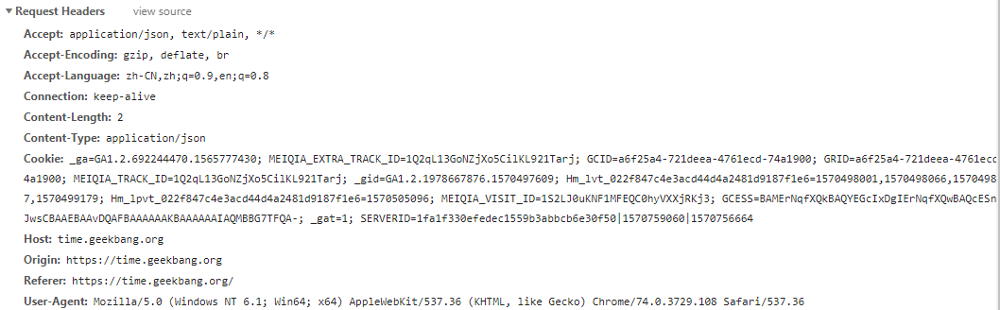

## HTTP/1.0、1.1、2.0

### 一. 前言
HTTP协议是七层协议中的应用层，TCP协议是传输层。  
HTTP基于TCP，所以很多HTTP瓶颈也在于TCP。

### 二. HTTP/1.0
#### 1. 无状态
服务器不跟踪不记录请求过的状态

#### 2. 无连接
浏览器和服务器之间默认只保持短暂连接（**需要使用`keep-alive`参数来告知服务器建立一个长连接**），浏览器每次请求都需要建立一个TCP连接（即3次握手和4次挥手），请求完之后立即断开这个连接，也因此使得网络复用率非常低。
```
建立连接 -> 客户端发送请求 -> 服务端发送响应信息 -> 关掉连接
```

#### 3. 缓存策略
强缓存：`Expires`； 协商缓存：`Last-Modified/I-Modified-Since`； 作为缓存判断的标准，存在一定缺陷。

### 三. HTTP/1.1
#### 1. 长连接
HTTP1.1默认保持长连接，复用同一个TCP通道，节省了3次握手和慢启动的时间。

#### 2. 管线化
基于长连接的基础，管线化可以不等待第一个请求的响应，继续发送后面的请求，但响应的顺序还是按照请求顺序返回
```
// TCP不断开，没有管线化，使用同一个通道
请求1 > 响应1 --> 请求2 > 响应2 --> 请求3 > 响应3
```
```
// 管线化的请求响应
请求1 --> 请求2 --> 请求3 > 响应1 --> 响应2 --> 响应3
```

#### 3. 缓存策略
新增了，强缓存：`Cache-Control`； 协商缓存：`Etag/If-None-Match`，针对HTTP1.0的缺陷做了改进。

#### 4. 断点传输
在上传/下载资源时，如果资源过大，将其分割为多个部分，分别上传下载，如果遇到网络故障，可以从已经上传/下载好的地方继续请求不用从头开始，提高效率。  
通过`Header`中的两个参数实现，客户端：`Range`，服务端响应：`Content-Range`。

### 四. HTTP/1.X 的缺陷和SPDY协议
#### 1. 线头阻塞带来性能问题
线头阻塞（`Head-Of-Line Blocking`）导致带宽无法被充分利用，以及后续健康请求被阻塞。`HOLB`是指一系列包（`package`）因为第一个包被阻塞；HTTP/1.X中由于必须按接受请求的顺序发送响应的规则限制，那么假设浏览器在一个TCP连接上发送了两个请求，那么服务器必须等待第一个请求响应完毕才能发送第二个响应。


针对线头阻塞，人们尝试过以下方法来解决：
* 将同一页面下的资源分散到不同的域名下，提升连接上限。**Chrome有个机制，对于同一域名，默认最多允许同时建立6个TCP持久连接**，使用持久连接时，虽然能公用一个TCP管道，但**在一个TCP管道中同一时刻只能处理一个请求**，在当前请求没有结束之前，其他请求只能处于阻塞状态。例如，在同一域名下同时有10个请求发生，那么有4个将进入排队等待状态，直至进行中的请求完成。
* Spriting（雪碧图）合并一张小图为多张大图，再用JS或者CSS将小图重新切割出来使用。
* 内联（Inlining）是另一种防止发送很多小图请求的技巧，将图片的原始数据嵌入在CSS文件里面的URL当中，减少网络请求次数。
    ```css
    .icon1 {
        background: url(data:image/png;base64,<data>) no-repeat;
    }
    ```
* **拼接**，将多个体积较小的JS文件使用webpack等工具打包成一个体积更大的JS文件。但这样做的问题是：一旦其中某一个组成文件发生了变动，整个大文件都会被重新加载。

#### 2. 无状态导致巨大的HTTP头部
HTTP/1.X中Header内容过大，并且请求响应报文中许多字段都是重复的，增加了传输成本。



#### 3. 明文传输，安全隐患
HTTP/1.X中传输的内容都是明文，客户端和服务端双方无法验证身份。这在一定程度上无法保证数据的安全性。

#### 4. 不支持服务器推送消息

#### 5. SPDY协议
由于上述HTTP/1.X的缺陷，2009年，谷歌推出了自行研发的SPDY协议，正式改造HTTP协议本身，降低延迟，压缩header等等。SPDY的实践证明了这些优化的效果，也最终带来了HTTP/2的诞生。  


### 五. HTTP 2.0
#### 1. 二进制分帧
HTTP/1.X协议的三个组成部分：`line、header、body`，并且这三部分都基于文本。**HTTP/2.0将请求和响应数据分割为更小的帧，并且采用二进制编码，协议解析起来更加高效**。  
HTTP/2.0的格式定义十分高效且精简。`length`定义了整个`frame`的大小，`type`定义了`frame`的类型（一共10种），`flags`用`bit`位定义了一些重要参数，`stream id`用作流程控制，`payload`就是`request`的正文。  
HTTP/2中，同个域名下所有通讯都在单个TCP连接上完成，该连接可以承载任意数量的双向数据流。每个数据流都以消息的形式发送，而消息又由一个或多个帧组成。**多个帧之间可以乱序发送，根据帧首部的流标识可以重新组装。**


#### 2. 头部压缩
HTTP/1.X的`header`由于`cookie`和`user agent`很容易膨胀，而且每次都要重复发送。  
* HTTP/2使用`encoder`来减少需要传输的`header`的大小，通讯双方各自`cache`一份`header fields`表，即避免了重复`header`的传输，又减小了需要传输的大小。  
* 高效的压缩算法（`HPACK`）可以很大程度压缩`header`，减少发送包的数量，从而降低延迟。

#### 3. 流（steam）和多路复用


基于二进制分帧，HTTP/2不再依赖TCP链接去实现多流并行。  
**在HTTP2中**
* 同域名下所有通讯都在单个TCP连接上完成
* 单个连接可以承载任意数量的双向数据流
* 数据流以消息的形式发送，而消息又由一个或多个帧组成，多个帧之间可以乱序发送，然后根据帧首部的流标识重新组装

**上述特性为性能带来了极大提升：**
* 同个域名只需要占用一个TCP连接，使用一个连接并行发送多个请求和响应，这样整个页面资源的下载过程只需要一次慢启动，同时也避免了多个TCP连接竞争带宽所带来的问题。
* 并行交错地多个请求/响应，请求/响应之间互不影响
* 在HTTP/2中，每个请求都可以带一个`31bit`的优先值，`0`表示最高优先级，数值越大，优先级越低。有了这个优先级，客户端和服务端就可以在处理不同的流时采取不同的策略，以最优先的方式发送流、消息和帧

#### 4. 服务器推送
服务端能够通过push的方式，将客户端需要的内容预先推送过去，也叫“cache push”


### 六. 基于HTTP/2的web优化
#### 1. 从HTTP/1.X到2.0的通用优化规则
1. **减少DNS查询**。DNS查询需要时间，没有resolved的域名会阻塞请求。
2. **减少TCP连接**。HTTP/2只使用一个TCP连接。
3. **使用CDN**。使用CDN分发资源可以减少延迟。
4. **减少HTTP跳转**。特别是非同一域名的跳转，需要DNS，TCP，HTTP山中开销。
5. **消除不必要的请求数据**。HTTP/2压缩了header。
6. **压缩传输数据**。gzip压缩很高效。
7. **客户端资源缓存**。缓存是必要的。
8. **消除不必要的资源**。激进的提前获取资源对客户端和服务端都开销巨大。

#### 2. 因HTTP/2不一样的优化规则
下面是一些HTTP/1.x推荐，HTTP/2禁止的优化。
1. **Domain Sharding（域名分片）**：HTTP/1.x中，浏览器一般每个域名最多同时使用6个连接。每个连接都会经历3次握手，消耗服务器资源，甚至会相互堵塞。然而1.X中我们仍然使用域名分片突破连接数的限制（提高并行加载能力）。
2. **Concatenation（文件合并）**：1.x中我们经常使用文件合并减少请求。但是：
    * 大文件会延迟客户端的处理执行（必须等到整个文件下载完）。
    * 缓存失效的开销昂贵：很少量的数据更新会使整个大文件缓存失效，然后需要重新下载整个大文件。
    * 破坏了颗粒化的资源缓存，更新和重新生效。
    * 此外，文件合并也需要额外的构建处理，增加项目复杂度。
    所以在HTTP/2中，请避免文件合并。使用小的颗粒化资源，优化缓存政策。
3. **Inline resource（内联资源）**：内联资源也是1.x中常用的优化手段，可以减少请求。但是内联资源无法独立缓存，也破坏了HTTP/2的多路复用和优先级策略（使用了父资源的优先级，也没法被客户端拒绝）。  
    HTTP/2中不要再使用内联资源，直接使用Server push：
    * 颗粒化的资源可以被独立缓存
    * 颗粒化的资源可以被正确的利用多路复用传输和设置优先级
    * 允许客户端更灵活地控制资源的下载和使用


### 七. HTTP/3
TODO: 具体内容待填充...

### 八. 引用
[HTTP2简介和基于HTTP2的Web优化](https://github.com/creeperyang/blog/issues/23)

[解密HTTP/2与HTTP/3 的新特性](https://juejin.im/post/5d9abde7e51d4578110dc77f)

[http1.0、1.1、2.0 协议的区别？](https://github.com/Advanced-Frontend/Daily-Interview-Question/issues/232)