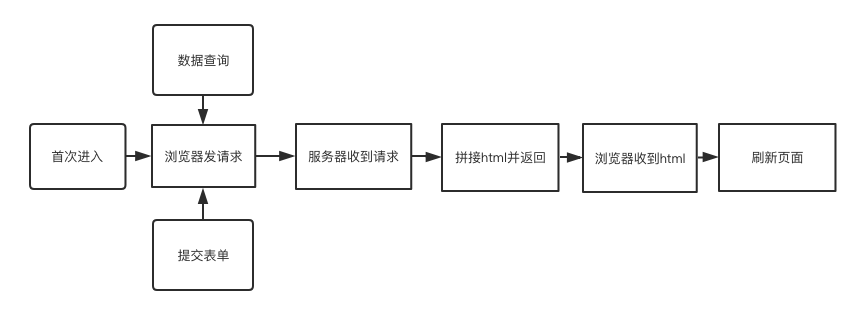
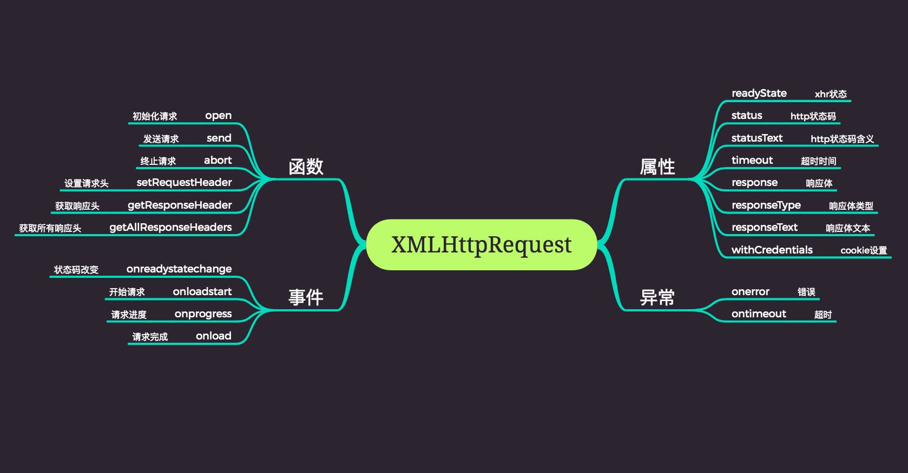
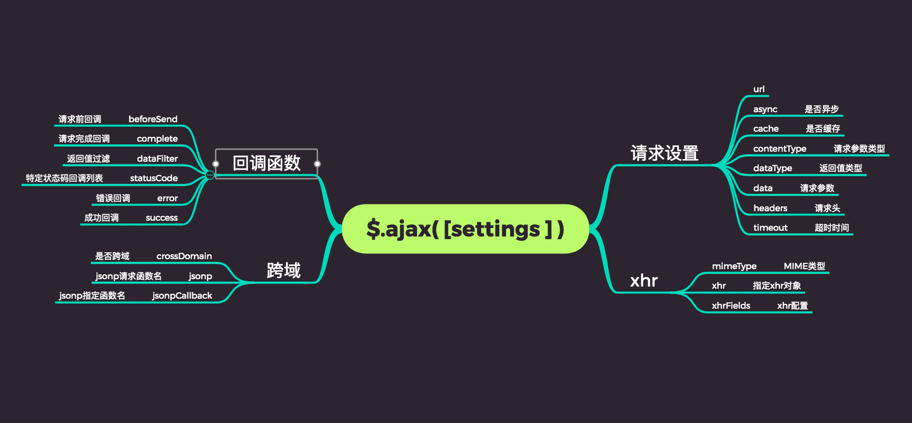
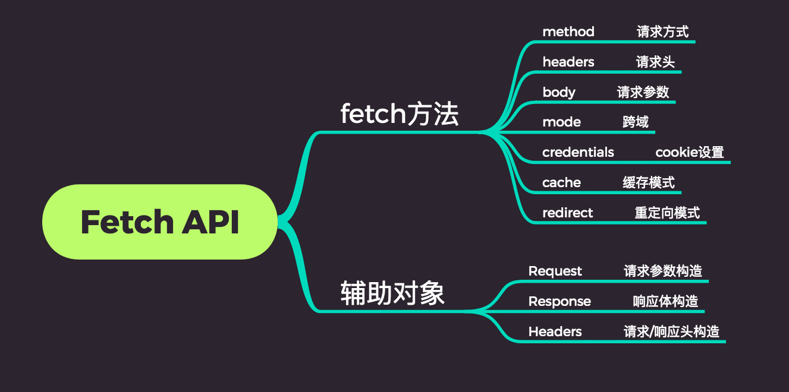

## 前端的网络请求方式详解

### 一. 前端进行网络请求的关注点
* 传入基本参数（`url`，请求方式）
* 请求参数、请求参数类型
* 设置请求头
* 获取响应的方式
* 获取响应头、响应状态、响应结果
* 异常处理
* 携带`cookie`设置
* 跨域请求

### 二. 前端进行网络请求的方式
* `form`表单、`ifream`、刷新页面
* `Ajax`、`jQuery`、`axios`
* `Fetch` - `Ajax`的替代者
* `node`中`http/https`模块 ，`request`、`node-fetch` 等众多开源库

### 三. Form表单

### 四. Ajax
#### 1. Ajax的出现解决的什么问题
在`Ajax`出现之前，`web`程序是这样工作的：



这种交互的缺陷是显而易见的，任何和服务器的交互都需要刷新页面，用户体验非常差，`Ajax`的出现解决了这个问题。`Ajax`全称`Asynchonous JavaScript + XML`（异步`JavaScript`和`XML`）  
使用`Ajax`，网页应用能够快速地将增量更新呈现在用户界面上，而不需要重载（刷新）整个页面。  
`Ajax`本身不是一种新技术，而是用来描述一种使用现有技术集合实现的一个技术方案，浏览器的`XMLHttpRequest`是实现`Ajax`最重要的对象（`IE6`以下使用`ActiveXObject`）。  
尽管X在`Ajax`中代表XML，但由于`JSON`的许多优势，比如更加轻量以及作为`JavaScript`的一部分，目前`JSON`的使用比XML更加普遍。

#### 2. 原生Ajax的用法
```js
// 基本示例

// 创建XMLHttpRequest对象，其实一般不需要考虑兼容性（axios这种级别的库都没做兼容）
var xhr = null;
if (window.XMLHttpRequest) {
    // 兼容IE7+，Firefox，Chrome，Opera，Safari
    xhr = new XMLHttpRequest();
} else {
    // 兼容IE6，IE5
    xhr = new ActiveXObject('Microsoft.XMLHTTP');
}

xhr.open('post', 'http://www.baidu.com', true);
// 接受返回值
xhr.onreadystatechange = function() {
    if (xhr.readyState === 4) {
        if (xhr.status >= 200 && xhr.status < 300 || xhr.status === 304) {
            console.log(xhr.responseText);
        }
    }
};
// 处理请求参数
var postData = {
    "pageSize": 20,
    "pageIndex": 1,
    "activityId": 12345,
    "end": 2
};
postData = (function(value) {
    var dataString = '';
    for (var key in value) {
        dataString += key + '=' + value[key] + '&';
    }
    return dataString;
})(postData);
// 设置请求头
xhr.setRequestHeader('Content-Type', 'application/x-www-form-urlencoded');
// 异常处理
xhr.onerror = function() {
    console.log('Network request failed');
};
// 跨域携带cookie
xhr.withCredentials = true;
// 发出请求
xhr.send(postData);
```

#### 3. XMLHttpRequest 对象常用的函数、属性、事件


1. **函数**
    * `open` 用于初始化一个请求。
        ```js
        xhr.open(method, url, async);
        ```
        * `method`：请求方式，如`get`、`post`
        * `url`：请求的`url`
        * `async`：是否为异步请求
    
    * `send` 用于发送`HTTP`请求，即调用该方法后`HTTP`请求才会被真正发出
        ```js
        xhr.send(param);
        ```
        * `param`：http请求的参数，可以为`string、Blob`等类型
    
    * `abort` 用于终止一个`ajax`请求，调用此方法后`readyState`将被设置为`0`
        ```js
        xhr.abort();
        ```
    
    * `setRequestHeader` 用于设置`HTTP`请求头，此方法必须在`open()`和`send()`之间调用
        ```js
        xhr.setRequestHeader(header, value);
        ```
    
    * `getResponseHeader` 用户获取`http`返回头，如果在返回头中有多个一样的名称，那么返回的值就会是用逗号和空格将值分隔的字符串
        ```js
        var header = xhr.getResponseHeader(name);
        ```

2. **属性**
    * `readyState`  
        用来标识当前XMLHTTPRequest对象所处的状态，XMLHTTPRequest总是位于下列状态中的一个：
        |值  | 状态 | 描述|
        |:- |:- |:-|
        |0 | `UNSEND` | 代理被创建，但尚未调用`open()`方法|
        |1 | `OPENED` | `open()`方法已经被调用
        |2 | `HEADERS_RECIVED` | `send()`方法已经被调用，并且头部和状态已经可获得
        |3 | `LOADING` | 下载中，`responseText`属性已包含部分数据
        |4 | `DONE` | 下载操作已完成

    * `state`  
        表示`http`请求的状态，初始值为`0`。如果服务器没有显示地指定状态码，那么`state`将被设置为默认值，即`200`
    
    * `responseType`  
        表示响应的数据类型，并允许我们手动设置，如果为空，默认为`text`类型
        |值  | 描述|
        |:- |:-|
        |`""` | 将`responseType`设置为空字符串与设置为`text`相同，是默认类型（实际上是`DOMString`）
        |`"arraybuffer"` | `response`是一个包含二进制数据的`JavaScript ArrayBuffer`
        |`"blob"` | `response`是一个包含二进制数据的`Blob`对象
        |`"document"` | `response`是一个`HTML Document`或`XML XMLDocument`，这取决于接收到的数据的`MIME`类型
        |`"json"` | `response`是一个`JavaScript`对象。这个对象是通过将接收到的数据类型视为`JSON`解析得到的
        |`"text"` | `response`是包含在`DOMString`对象中的文本
    
    * `response`  
        返回响应的正文，返回的类型又上面的`responseType`决定。  
    
    * `withCredentials`  
        `ajax`请求默认会携带同源请求的`cookie`，而跨域请求则不会携带`cookie`，设置`xhr`的`withCredentials`属性为`true`将允许携带跨域`cookie`

3. **事件**
    * `onreadystatechange`  
        ```js
        xhr.onreadystatechange = callback;
        ```
        当`readyState`属性发生变化时，`callback`会被触发。
    
    * `onloadstart`  
        ```js
        xhr.onloadstart = callback;
        ```
        在`ajax`请求发送之前（`readyState==1`后，`readyState==2`前），`callback`会被触发。
    
    * `onprogress`  
        ```js
        xhr.onprogress = function(event) {
            console.log('progress: ', event)
        }
        ```
        回调函数可以获取资源总大小`total`，已经加载的资源大小`loaded`，用这两个值可以计算加载进度。

    * `onload`  
        ```js
        xhr.onload = callback;
        ```
        当一个资源及其依赖资源已经完全加载时，将触发`callback`，通常我们会在`onload`事件中处理返回值。

4. **异常**
    * `onerror`  
        ```js
        xhr.onerror = callback;
        ```
        当`ajax`资源加载失败时会触发`callback`。
    
    * `ontimeout`  
        ```js
        xhr.ontimeout = callback;
        ```
        当进度由于预定时间到期而终止时，会触发`callback`，超时时间可以使用`timeout`属性进行设置。

#### 3. jQuery 对 Ajax 的封装
```js
$.ajax({
    url: 'http://www.baidu.com',
    dataType: 'json',   // 设置返回值类型
    headers: {  // 设置请求头
        'Content-Type': 'application/json'
    },
    xhrFields: {
        withCredentials: true   // 跨域携带cookie
    },
    data: JSON.stringify({ a: [{ b: 1, a: 1 }] }),  // 传递参数
    error: function (xhr, status) {}, // 错误处理
    success: function (xhr, status) {}   // 获取结果
})
```
`$.ajax`接收一系列配置，其自己封装了一个`jqHXR`对象。  



1. **url**  
    发送请求的地址。

2. **type**  
    类型：`String`  
    请求方式（`"POST"`或`"GET"`），默认为`"GET"`。  
    注意：其他`HTTP`请求方法，如`PUT`和`DELETE`也可以使用，但仅部分浏览器支持。

3. **async**  
    类型：`Boolean`  
    默认值：`true`  
    默认设置下，所有请求均为异步请求。如果需要同步发送请求，需要设置为`false`

4. **timeout**  
    类型：`Number`  
    设置请求超时时间（毫秒），此设置将覆盖全局设置。

5. **cache**  
    类型：`Boolean`  
    默认值：`true`  
    `GET`请求在浏览器中将被默认缓存，设置为`false`则不会缓存`GET`请求。其工作原理就是在`GET`请求参数中附加时间戳`"_={timestamp}"`

6. **dataType**  
    ```js
    "xml": 返回XML文档，可用jQuery处理
    "html": 返回纯文本HTML信息；包含的script标签会在插入DOM时执行
    "script": 返回纯文本JavaScript代码，不会自动缓存结果。除非设置了"cache"参数。注意：在远程请求时（不在同一个域下），所有POST请求都将转为GET请求。（因为将使用DOM的script标签来加载）
    "json": 返回JSON数据
    "jsonp": JSONP格式。使用JSONP形式调用函数时，如"myurl?callback=?"jQuery将自动替换?为正确的函数名，以执行回调函数。
    "text": 返回纯文本字符串
    ```

7. **contentType**  
    类型：`String`  
    默认值：`application/x-www-form-urlencoded`  
    发送信息至服务器时内容的编码类型。

8. **data**  
    类型：`String`  
    使用`JSON.stringify`转码

9. **success**  
    请求成功后的回调函数

10. **complete**  
    请求完成后回调函数（请求成功或失败均调用）

11. **error**  
    请求失败时调用此函数。
    注意：源码里对错误的判定。
    ```js
    isSuccess = status >= 200 && status < 300 || status === 304;
    ```

12. **jsonp**  
    在一个`jsonp`请求中重写回调函数的名字。这个值用来替代在`"callback=?"`这种`GET`或`POST`请求中·参数里的`"callback"`部分

### 五. Fetch
`Fetch API`是一个用于访问和操纵`HTTP`管道的强大的原生`API`。

> 这种功能以前是使用`XMLHttpRequest`实现的。`Fetch`提供了一个更好的替代方法，可以很容易地被其他技术使用，例如`Service Workers`。`Fetch`还提供了单个逻辑位置来定义其他`HTTP`相关概念，例如`CORS`和`HTTP`的扩展。

使用`Fetch`，你不需要再额外加载一个外部资源。但它还没有被浏览器完全支持，所以你仍然需要一个`polyfill`。

#### 1. fetch的使用
```js
const options = {
    method: 'POST', // 请求方式
    headers: { 'Content-Type': 'application/json' },    // 设置请求头
    body: JSON.stringify({a:'b'}), // 请求参数
    credentials: 'same-origin', // cookie设置
    mode: 'cors'    // 跨域
}
fetch('http://www.test.com/api/postData', options)
    .then(function(response) {
        console.log('response', response)
        return response.json()
    })
    .then(function(myJson) {
        console.log(myJson) // 响应数据
    })
    .catch(function(err) {
        console.log(err)    // 异常处理
    })
```
`Fetch API`提供了一个全局的`fetch()`方法，以及几个辅助对象来发起一个网络请求。



* `fetch()`  
    `fetch()`方法用于发起获取资源的请求。它返回一个`promise`，这个`promise`会在请求响应后`resolve`，并传回`Response`对象

* `Headers`  
    可以通过`Headers`构造函数来创建一个你自己的`headers`对象，相当于`response/request`的头信息，可以使你查询到这些头信息，或者针对不同的结果做不同的操作。

* `Request`  
    通过`Request`构造函数可以创建一个`Request`对象，这个对象可以作为`fetch`函数的第二个参数。

* `Response`  
    在`fetch()`处理完`promise`之后返回一个`Response`实例，也可以手动创建一个`Response`实例。

```js
// 自定义请求对象
var myHeaders = new Headers();
var myInit = {
    method: 'GET',
    headers: myHeaders,
    mode: 'cors',
    cache: 'default'
};
var myRequest = new Request('flowers.jpg', myInit);

fetch(myRequest).then(function(response) {
    return response.blob();
}).then(function(myBlob) {
    var objectURL = URL.createObjectURL(myBlob);
    myImage.src = objectURL;
});
```

#### 2. fetch polyfill 源码分析
由于`fetch`是一个非常底层的`API`，所以我们无法进一步探究它的底层，但是我们可以借助它的`polyfill`探究它的基本原理，并找出其中的坑点。

1. **代码结构**  
    ```js
    export function Headers(headers) {
        // ...
    }
    export function Request(input, options) {
        // ...
    }
    export function Response(bodyInit, options) {
        // ...
    }
    export function fetch(input, init) {
        // ...
    }

    fetch.polyfill = true

    if (!self.fetch) {
        self.fetch = fetch
        self.Headers = Headers
        self.Request = Request
        self.Response = Response
    }
    ```
    `polyfill`主要对`Fetch API`提供的四大对象进行了封装。

2. **fetch封装**  
    ```js
    export function myFetch(input, init) {
        return new Promise(function (resolve, reject) {
            var request = new Request(input, init)
            var xhr = new XMLHttpRequest()
            xhr.open(request.method, request.url, true)
            xhr.onload = function () {
                var options = {
                    status: xhr.status,
                    statusText: xhr.statusText,
                    headers: parseHeaders(xhr.getAllResponseHeaders() || '')
                }
                options.url = 'responseURL' in xhr ? xhr.responseURL : options.headers.get('X-Request-URL')
                var body = 'response' in xhr ? xhr.response : xhr.responseText

                resolve(new Response(body, options))
            }
            request.headers.forEach(function (value, name) {
                xhr.setRequestHeader(name, value)
            })
            xhr.send()
        })
    }
    ```
    * 构造一个`Promise`并返回
    * 创建一个`Request`对象
    * 创建一个`XMLHttpRequest`对象
    * 取出`Request`对象中的请求`url`、请求方式，`open`一个`xhr`请求，并将`Request`对象中`headers`取出，赋值给`xhr`
    * `xhr onload`后取出`response`的`status`、`headers`、`body`封装`Response`对象，调用`resolve`

3. **异常处理**  
    ```js
    return new Promise(function (resolve, reject) {
        // ...
        function abortXHr() {
            xhr.abort()
        }

        xhr.onerror = function () {
            reject(new TypeError('Network request failed'))
        }
        xhr.ontimeout = function () {
            reject(new TypeError('Network request failed'))
        }
        xhr.onabort = function () {
            reject(new DOMException('Aborted', 'AbortError'))
        }

        if (request.signal) {
            request.signal.addEventListener('abort', abortXHr)
            xhr.onreadystatechange = function() {
                // DONE (success or failure)
                if (xhr.readyState === 4) {
                    request.signal.removeEventListener('abort', abortXHr)
                }
            }
        }
        // ...
    }
    ```
    可以发现，调用`reject`有三种可能：
    * 请求超时
    * 请求失败  
        注意：当和服务器建立连接并收到服务器的异常状态码如`404、500`并不能触发`onerror`。当网络故障时或请求被阻止时，才会被标记为`reject`，如跨域、`url`不存在、网络异常等会触发`onerror`。  
        所以使用`fetch`，当接收到异常状态码都是会进入`then`而不是`catch`。这些错误请求往往需要手动处理。
    * 手动终止  
        可以在`request`参数中传入`signal`对象，并对`signal`对象添加`abort`事件监听，当`xhr.readyState`变为`4`（响应内容解析完成）后，将`signal`对象的`abort`事件监听移除掉。  
        这表示，在一个`fetch`请求结束之前，可以调用`signal.abort`将其终止。在浏览器中可以使用`AbortController()`构造函数创建一个控制器，然后使用`AbortController.signal`属性
        > 这是一个实验中的功能，此功能某些浏览器尚在开发中

4. **Headers对象**  
    ```js
    export function Headers(headers) {
        this.map = {}

        if (headers instanceof Headers) {
            headers.forEach(function (value, name) {
                this.append(name, value)
            }, this)
        } else if (Array.isArray(headers)) {
            headers.forEach(function (header) {
                this.append(header[0], header[1])
            }, this)
        } else if (headers) {
            Object.getOwnPropertyNames(headers).forEach(function (name) {
                this.append(name, headers[name])
            }, this)
        }
    }
    ```
    在`Headers`中维护了一个`map`对象，构造函数中可以传入`Header`对象、数组、普通对象类型的`headers`，并将所有的值维护到`map`中。  

    之前在`fetch`函数中看到调用了`headers`的`forEach`方法，下面是它的实现：
    ```js
    Headers.prototype.forEach = function (callback, thisArg) {
        for (var name in this.map) {
            callback.call(thisArg, this.map[name], name, this.map)
        }
    }
    ```
    可见`headers`的遍历即其内部`map`的遍历。  
    另外，`Headers`还提供了`append、delete、get、set`等方法，都是对其内部的对象进行操作。

5. **Request对象**  
    ```js
    export function Request(input, options) {
        options = options || {}
        var body = options.body

        if (input instanceof Request) {
            this.url = input.url
            this.method = input.method
            // ...
        } else {
            this.url = String(input)
        }
        this.cridentials = options.cridentials || this.cridentials || 'same-origin'
        if (options.headers || !this.headers) {
            this.headers = new Headers(options.headers)
        }
        this.method = normalizeMethod(options.method || this.method || 'GET')
        this.mode = options.mode || this.mode || null
        this.signal = options.signal || this.signal
        this.referrer = null
        // ...
        this._initBody(body)
    }
    ```
    `Request`对象接收的两个参数即`fetch`函数接受的两个参数，第一个参数可以直接传递`url`，也可以传递一个构造好的`Request`对象。第二个参数即控制不同配置的`option`对象。  
    可以传入`credentinals、headers、method、mode、signal、referrer`等属性。  
    这里注意：
    * 传入的`headers`被当做`Headers`构造函数的参数来构造`headers`对象。

6. **cookie处理**  
    fetch函数中还有如下的代码：
    ```js
    if (request.credentials === 'include') {
        xhr.withCredentials = true
    } else if (request.credentials === 'omit') {
        xhr.withCredentials = false
    }
    ```
    在新版浏览器中，`credentials`默认值已改为`same-origin`（即可以携带同源请求的`cookie`），旧版依然是`omit`（不可携带同源请求的`cookie`）。
    * `same-origin`：只携带同源（跨域不携带）请求的`cookie`
    * `include`：携带跨域请求`cookie`
    * `omit`：同源、跨域都不携带`cookie`

7. **Response对象**  
    `Response`构造函数
    ```js
    export function Response(bodyInit, options) {
        if (!options) {
            options = {}
        }

        this.type = 'default'
        this.status = options.status === undefined ? 200 : options.status
        this.ok = this.status >= 200 && this.status < 300
        this.statusText = 'statusText' in options ? options.statusText : 'OK'
        this.headers = new Headers(options.headers)
        this.url = options.url || ''
        this._initBody(bodyInit)
    }

    Body.call(Response.prototype)
    ```
    可见在构造函数中主要对`options`中的`status、statusText、headers、url`等分别作了处理，挂载到`Response`对象上。  
    构造函数里并没有对`ResponseText`的明确处理，最后交给`_initBody`函数处理，而`Response`并没有主动声明`_initBody`属性，代码最后使用`Response`调用了Body函数，实际上`_initBody`函数是通过`Body`函数挂载到`Response`身上的，先来看`_initBody`函数：
    ```js
    this._initBody = function(body) {
        if (!body) {
            this._bodyText = ''
        } else if (typeof body === 'string') {
            this._bodyText = body
        } else if (support.blob && Blob.prototype.isPrototypeOf(body)) {
            this._bodyBlob = body
        } else if (support.formData && FormData.prototype.isPrototypeOf(body)) {
            this._bodyFormData = body
        }
        // else if ...
        else {
            this._bodyText = body = Object.prototype.toString.call(body)
        }
    }
    ```
    可见，`_initBody`函数根据`xhr.Response`的类型（`Blob、FormData、String...`），为不同的参数进行赋值，这些参数在`Body`方法中得到不同的应用，下面具体看看`Body`函数具体还做了哪些其他操作：
    ```js
    function Body() {
        this.bodyUser = false
        this._initBody = function(body) {
            // ...
        }
        this.text = function() {
            // _bodyText ...
        }
        this.json = function() {
            this.text().then(JSON.parse)
        }
        if (support.blob) {
            this.blob = function() {
                // _bodyBlob ...
            }
        }
        if (support.formData) {
            this.formData = function() {
                // _bodyFormData ...
            }
        }
        return this
    }
    ```
    `Body`函数中还为`Response`对象挂载了4个函数，`text、json、blob、formData`，这些函数中的操作就是将`_initBody`中得到的不同类型的返回值返回。  
    这也说明了，在`fetch`执行完毕后，不能直接在`response`中获取到返回值而必须调用`text()、json()`等函数才能获取到返回值。  
    这里还有一点需要说明，几个函数中都有下面类似的逻辑：  
    ```js
    var rejected = consumed(this)
    if (rejected) {
        return rejected
    }
    ```
    `consumed`函数：
    ```js
    function consumed(body) {
        if (body.bodyUsed) {
            return Promise.reject(throw new TypeError('Aleady read'))
        }
        body.bodyUsed = true
    }
    ```
    每次调用`text()、json()`等函数后，会将`bodyUsed`变量变为`true`，用来标识返回值已经读取过了，下一次再读取直接抛出`TypeError('Aleady read')`。这也遵循了原生`fetch`的原则：
    > 因为`Response`对象被设置为了`stream`的方式，所以它们只能被读取一次

#### 3. fetch的坑点
由于`fetch`是一个非常底层的`API`，它并没有进行很多封装，还有许多问题需要处理：
* 不能直接传递`JavaScript`对象作为参数
* 需要自己判断返回值类型，并执行响应获取返回值的方法
* 获取返回值方法只能调用一次，不能多次调用
* 无法正常地捕获异常
* 老版浏览器不会默认携带`cookie`
* 不支持`jsonp`

#### 4. 对fetch的封装
1. **请求参数处理**  
    支持传入不同的参数类型：
    ```js
    function stringify(url, data) {
        var dataString = url.indexof('?') === '-1' ? '?' : '&'
        for (var key in data) {
            dataString += `${key}=${data[key]}&`
        }
        return dataString
    }

    if (request.formData) {
        request.body = request.data
    } else if (/^get$/i.test(request.method)) {
        request.url = `${request.url}${stringify(request.url, request.data)}`
    } else if (request.form) {
        request.headers.set('Contetn-Type', 'application/x-www-form-urlencoded;charset=UTF-8')
        request.body = stringify(request.data)
    } else {
        request.headers.set('Contetn-Type', 'application/json;charset=UTF-8')
        request.body = JSON.stringify(request.data)
    }
    ```

2. **cookie携带**  
    `fetch`在新版浏览器已经开始默认携带同源`cookie`，但在老版浏览器中不会默认携带，我们需要进行统一处理：
    ```js
    request.credentials = 'same-origin' // 同源携带
    request.credentials = 'include' // 可跨域携带
    ```

3. **异常处理**  
    > 当接收到一个代表错误的`HTTP`状态码时，从`fetch()`返回的`Promise`不会被标记为`reject`，即使该`HTTP`响应的状态码是`404`或`500`。相反，它会将`Promise`状态标记为`resolve`（但会将`resolve`的返回值的`ok`属性设置为`false`），仅当网络故障或请求被阻止时，才会标记为`reject`。

    因此我们要对fetch的异常进行统一处理，
    ```js
    .then(response => {
        if (response.ok) {
            return Promise.resolve(response)
        } else {
            const error = new Error(`请求失败！状态码：${response.status}，失败信息：${response.statusText}`)
            error.response = response
            return Promise.reject(error)
        }
    })
    ```
4. **返回值处理**  
    对不同的返回值类型调用不同的函数接受，这里必须提前判断好类型，不能多次调用获取返回值的方法：  
    ```js
    .then(response => {
        const contentType = response.headers.get('content-type')
        if (contentType.includes('application/json')) {
            return response.json()
        } else {
            return response.text()
        }
    })
    ```

5. **jsonp**  
    `fetch`本身没有提供对`jsonp`的支持，`jsonp`本身也不属于一种非常好的跨域解决方案，推荐使用`cors`或者`nginx`解决跨域。

### 六. 引用
[全面分析前端的网络请求方式](https://juejin.im/post/5c9ac607f265da6103588b31#heading-21)