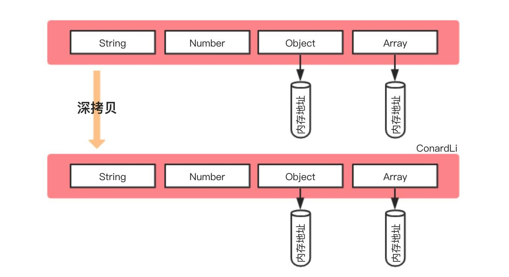

## 浅拷贝 & 深拷贝

### 一. 浅拷贝和深拷贝
1. **浅拷贝**


创建一个新对象，这个对象有着原始对象属性值的一份精确拷贝。如果属性是基本类型，拷贝的就是基本类型的值，如果属性是引用类型，拷贝的就是内存地址，所以如果其中一个对象改变了这个地址，就会影响到另一个对象。

2. **深拷贝**


讲一个对象从内存中完整的拷贝一份出来，从堆内存中开辟一个新的区域存放新对象，且修改新对象不会影响原对象。

### 二. 浅拷贝的实现方式
1. `Object.assign()`
    ```js
    var obj = { a: {a: 'kobe', b: 39} }
    var initalObj = Object.assign({}, obj)
    initalObj.a.a = 'wade'
    console.log(obj.a.a)   // wade
    ```
    **注意：当object只有一层的时候，是深拷贝**

2. `Array.prototype.concat()`
    ```js
    var arr = [1, 3, {
        userName: 'percy'
    }];
    var arr2 = arr.concat()
    arr2[2].userName = 'wade'
    console.log(arr[2].userName)    // wade
    ```

3. `Array.prototype.slice()`
    ```js
    var arr = [1, 3, {
        userName: 'percy'
    }];
    var arr2 = arr.slice()
    arr2[2].userName = 'wade'
    console.log(arr[2].userName)    // wade
    ```

### 三. 深拷贝的实现方式
1. `JSON.parse(JSON.stringify())`
    ```js
    var arr = [1, 3, {
        userName: 'percy'
    }, function() {}];
    var arr2 = JSON.parse(JSON.stringify(arr))
    arr2[2].userName = 'wade'
    console.log(arr[2].userName)    // percy
    ```
    **这种方法虽然可以实现数组和对象的深拷贝，但不能处理函数**
    ```js
    var arr = [1, 3, {
        userName: 'percy'
    }, function() {}];
    var arr2 = JSON.parse(JSON.stringify(arr))
    arr2    // [1, 3, {…}, null]
    ```

2. 深度优先，递归遍历
    ```js
    // 可继续遍历的数据类型
    const setTag = '[object Set]'
    const mapTag = '[object Map]'
    const arrayTag = '[object Array]'
    const objectTag = '[object Object]'
    const argsTag = '[object Arguments]'

    // 不可继续遍历的数据类型
    const boolTag = '[object Boolean]'
    const dateTag = '[object Date]'
    const errorTag = '[object Error]'
    const numberTag = '[object Number]'
    const regexpTag = '[object RegExp]'
    const stringTag = '[object String]'
    const symbolTag = '[object Symbol]'
    const funcTag = '[object Function]'

    const deepTag = [setTag, mapTag, arrayTag, objectTag, argsTag]

    // 使用while遍历，提升遍历性能
    function forEach(array, iteratee) {
        let i = -1
        const len = array.length
        while (++i < len) {
            iteratee(array[i], i)
        }
    }

    // 判断是否为引用类型
    function isObject(target) {
        const type = typeof target
        return target !== null && (type === 'object' || type === 'funciton')
    }

    // 获取数据实际类型
    function getType(target) {
        return Object.prototype.toString.call(target)
    }

    // 初始化被克隆的对象，同时保持原型指向
    // target为对象时，返回{}；target为数组时，返回[]...
    function getInit(target) {
        const Ctor = target.constructor
        return new Ctor
    }

    // 克隆正则表达式
    function cloneReg(target) {
        // 从正则末尾截取修饰符
        const reFlags = /\w*$/
        const result = new target.constructor(target.source, reFlags.exec(target))
        // RegExp对象是有状态的，克隆上一次匹配成功的位置
        result.lastIndex = target.lastIndex
        return result
    }

    // 克隆symbol类型
    function cloneSymbol(target) {
        // TODO: 不懂为什么要把Symbol包装成对象类型
        // return Object(Symbol.prototype.valueOf.call(target))
        return Symbol(target.description)
    }

    // 克隆函数
    function cloneFunction(taget) {
        // 蚂蚁金服一位哥们骚气的写法，目前没发现什么问题
        return eval('(' + target.toString() + ')')
    }

    // 克隆不可遍历类型
    function cloneOtherType(target, type) {
        const Ctor = target.constructor
        switch (type) {
            case boolTag:
            case numberTag:
            case stringTag:
            case errorTag:
            case dateTag:
                return new Ctor(target)
            case regexpTag:
                return cloneReg(target)
            case symbolTag:
                return cloneSymbol(target)
            case funcTag:
                return cloneFunction(target)
            default:
                return null
        }
    }

    // 使用WeakMap保存当前对象和拷贝对象关系，及时释放内存
    function clone(target, wm = new WeakMap()) {
        // 克隆原始类型 排除了object(不包括null)和function
        if (!isObject(target)) {
            return target
        }

        // 初始化
        const type = getType(target)
        let cloneTarget
        if (deepTag.includes(type)) {
            cloneTarget = getInit(target)
        } else {
            return cloneOtherType(target, type)
        }

        // 防止循环引用
        const stacked = wm.get(target)
        if (stacked) {
            return stacked
        }
        wm.set(target, cloneTarget)

        // 克隆set
        if (type === setTag) {
            target.forEach(value => {
                cloneTarget.add(clone(value, wm))
            })
            return cloneTarget
        }

        // 克隆map
        if (type === mapTag) {
            target.forEach((value, key) => {
                // TODO: 不太理解，这里为什么只深拷贝了value，不处理key
                cloneTarget.set(key, clone(value))
            })
        }

        // 克隆对象和数组
        const keys = type === arrayTag ? undefined : Object.keys(target)
        forEach(keys || target, (value, key) => {
            if (keys) {
                key = value
            }
            cloneTarget[key] = clone(target[key], wm)
        })

        return cloneTarget
    }
    ```

3. 广度优先  
    使用队列，`while`进行遍历
    ```js
    function getInit(target) {
        const type = Object.prototype.toString.call(target)
        if (type === '[object Object]') {
            return {}
        } else if (type === '[object Array]') {
            return []
        }
        return target
    }

    function cloneBFS(target) {
        const queue = []
        const map = new Map()   // 记录出现过的对象

        const cloneTarget = getInit(target)
        // 记录下引用类型，并添加到任务队列
        if (cloneTarget !== target) {
            queue.push([target, cloneTarget])
            map.set(target, cloneTarget)
        }

        while (queue.length) {
            const [tar, ctar] = queue.shift()
            for (let key in tar) {
                // 处理循环引用
                if (map.get(tar[key])) {
                    ctar[key] = map.get(tar[key])
                    continue
                }
                
                ctar[key] = getInit(tar[key])
                // 处理引用类型
                if (ctar[key] !== tar[key]) {
                    queue.push([tar[key], ctar[key]])
                    map.set(tar[key], ctar[key])
                }
            }
        }

        return cloneTarget
    }
    ```

### 四. lodash中deepclone源码分析


### 五. 总结
通过深拷贝可以考察到什么
1. 基本实现
    * 递归能力
    * 深度优先和广度优先两种遍历思想
2. 循环引用
    * 考虑问题的全面性
    * 理解weakmap的真正意义
3. 多种类型
    * 考虑问题的严谨性
    * 创建各种引用类型的方法，JS API的熟练程度
    * 准确判断数据类型，对数据类型的理解程度
4. 通用遍历
    * 写代码可以考虑性能优化
    * 了解几种遍历的效率
    * 代码抽象能力
5. 拷贝函数
    * 箭头函数和普通函数的区别（箭头函数没有`prototype`）

### 六. 引用

[如何写出一个惊艳面试官的深拷贝?](https://juejin.im/post/5d6aa4f96fb9a06b112ad5b1)

[Lodash是如何实现深拷贝的](https://github.com/yygmind/blog/issues/31)
