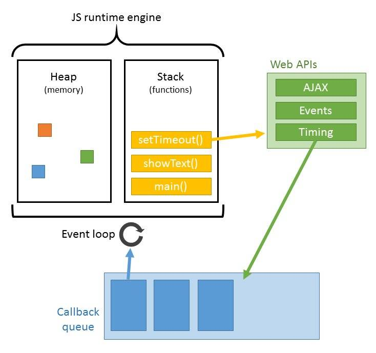

### Event Loop详细解析

#### 1. 进程与线程

进程是操作系统分配资源和调度任务的基本单位，线程是建立在进程上的一次程序运行单位，一个进程上可以有多个线程。

单线程特点是节约了内存,并且不需要在切换执行上下文。

#### 2. 执行栈与任务队列

1. 执行栈

    当我们调用一个方法的时候，js会生成一个与这个方法对应的执行环境（context），又叫执行上下文。这个执行环境中存在着这个方法的私有作用域，上层作用域的指向，方法的参数，这个作用域中定义的变量以及这个作用域的this对象。 而当一系列方法被依次调用的时候，因为js是单线程的，同一时间只能执行一个方法，于是这些方法被排队在一个单独的地方。这个地方被称为执行栈。  

    当一个脚本第一次执行的时候，js引擎会解析这段代码，并将其中的同步代码按照执行顺序加入执行栈中，然后从头开始执行。如果当前执行的是一个方法，那么js会向执行栈中添加这个方法的执行环境，然后进入这个执行环境继续执行其中的代码。当这个执行环境中的代码 执行完毕并返回结果后，js会退出这个执行环境并把这个执行环境销毁，回到上一个方法的执行环境。。这个过程反复进行，直到执行栈中的代码全部执行完毕。

2. 任务队列和事件循环
    1. Javascript内核加载代码到执行栈
    2. 执行栈依次执行主线程的同步任务，过程中若遇调用了异步Api则会添加回调事件到回调队列中。且微任务事件添加到微任务队列中，宏任务事件添加到宏任务队列中去。直到当前执行栈中代码执行完毕。
    3. 开始执行当前所有微任务队列中的微任务回调事件。    (注意是所有哦，相当于清空队列)
    4. 取出宏任务队列中的第一条(先进先出原则哦)宏任务，放到执行栈中执行。
    5. 执行当前执行栈中的宏任务，若此过程总又再遇到微任务或者宏任务，继续把微任务和宏任务进行各自队伍的入队操作，然后本轮的宏任务执行完后，又把本轮产生的微任务一次性出队都执行了。
    6. 以上操作往复循环...就是我们平时说的eventLoop了

        **特点：**
    * 微任务队列操作，总是会一次性清空队列
    * 宏任务队列每次只会取出一条任务到执行栈中执行
    
    

#### 3. 宏任务和微任务

* macro-task(宏任务):
    * script(整体代码)
    * setTimeout
    * setInterval
    * setImmediate
    * I/O
    * UI rendering

优先级： 主代码块 > `setImmediate` > `MessageChannel` > `setTimeOut/setInterval`

* micro-task(微任务):
    * process.nextTick,
    * 原生 Promise (有些实现的promise 将 then 方法放到了宏任务中，浏览器默认放到了微任务),
    * Object.observe (已废弃),
    * MutationObserver（不兼容，已废弃）
    * MessageChannel（vue中 nextClick 实现原理）

优先级： `process.nextTick` > `Promise` > `MutationOberser`

同步代码先执行，执行是在栈中执行的，微任务大于宏任务，微任务会先执行（栈），宏任务后执行（队列）
1. 宏任务总会在下一个EventLoop中执行
2. 若在执行宏任务的过程中，加入了新的微任务，会把新的微任务添加到微任务的队列中。
3. 若在执行微任务的过程中，加入了新的微任务，会把新的微任务添加在当前任务队列的队尾巴
4. 微任务会在本轮EventLoop执行完后，马上把执行栈中的任务都执行完毕

#### 4. Node.js的Event Loop
Node.js还提供了另外两个与“任务队列”相关的方法：`process.nextTick`和`setImmediate`

`process.nextTick`方法可以在当前执行栈的尾部——下一次Event Loop之前，触发回调函数。也就是说，他指定的任务总是发生在所有异步任务之前。   
`setImmediate`方法则是在当前任务队列的尾部添加事件，他指定的任务总是在下一次Event Loop时执行，与`setTimerout(fn, 0)`很像。

`process.nextTick`和`setImmediate`的一个重要区别：多个`process.nextTick`语句（不管他们是否嵌套）总是在当前"执行栈"一次执行完，多个`setImmediate`可能则需要多次loop才能执行完

#### 5. 辅助理解

运行下这段代码，Event Loop机制就非常清晰了
```js
console.log('golb1');

setTimeout(function() {
    console.log('timeout1');
    process.nextTick(function() {
        console.log('timeout1_nextTick');
    })
    new Promise(function(resolve) {
        console.log('timeout1_promise');
        resolve();
    }).then(function() {
        console.log('timeout1_then')
    })
})

setImmediate(function() {
    console.log('immediate1');
    process.nextTick(function() {
        console.log('immediate1_nextTick');
    })
    new Promise(function(resolve) {
        console.log('immediate1_promise');
        resolve();
    }).then(function() {
        console.log('immediate1_then')
    })
})

process.nextTick(function() {
    console.log('glob1_nextTick');
})
new Promise(function(resolve) {
    console.log('glob1_promise');
    resolve();
}).then(function() {
    console.log('glob1_then')
})

setTimeout(function() {
    console.log('timeout2');
    process.nextTick(function() {
        console.log('timeout2_nextTick');
    })
    new Promise(function(resolve) {
        console.log('timeout2_promise');
        resolve();
    }).then(function() {
        console.log('timeout2_then')
    })
})

process.nextTick(function() {
    console.log('glob2_nextTick');
})
new Promise(function(resolve) {
    console.log('glob2_promise');
    resolve();
}).then(function() {
    console.log('glob2_then')
})

setImmediate(function() {
    console.log('immediate2');
    process.nextTick(function() {
        console.log('immediate2_nextTick');
    })
    new Promise(function(resolve) {
        console.log('immediate2_promise');
        resolve();
    }).then(function() {
        console.log('immediate2_then')
    })
})
```

#### 引用
[JavaScript：彻底理解同步、异步和事件循环(Event Loop)](https://segmentfault.com/a/1190000004322358)

[深入核心，详解事件循环机制](https://www.jianshu.com/p/12b9f73c5a4f)

[微任务、宏任务与Event-Loop](https://juejin.im/post/5b73d7a6518825610072b42b)