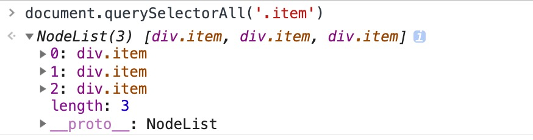

## NodeList
> 一切从一次sentry报错开始！！
> 在项目某一段代码中，我使用`querySelectorAll()`方法获取了一个节点结合，并且使用了数组方法`forEach()`去遍历他们，chrome下一切正常。自信上线。
> 次日，运维反馈，sentry服务挂了-_^，几十万条报错...

### 1. NodeList
`NodeList`对象是一个节点的集合，是由`Node.childNodes`和`document.querySelectorAll`返回的。

1. 在一些情况下，`NodeList`对象是一个实时集合，如果文档中节点树发生变化，则已经存在的`NodeList`实时对象也会随之变化。例如：`Node.childNodes`是实时的。  

    ```js
    const parent = document.getElementById('parent');
    const child_nodes = parent.childNodes;
    console.log(child_nodes.length);        // 假设结果是'2'
    parent.appendChild(document.creatElement('div'))
    console.log(child_nodes.length);        // 此时输出结果是'3'
    ```

2. 在其他情况下，`NodeList`是一个静态集合，随后对文档对象的任何改动都不会影响集合的内容。  
    比如`document.querySelectorAll`就会返回一个静态的`NodeList`

### 2. 为什么NodeList不是数组？
1. `NodeList`对象在很多方面和数组非常相似，看上去可以直接使用从Array.prototype上继承的方法。然而`NodeList`并没有这些类似数组的方法。    

    在一些较新的浏览器上也支持一些遍历方法，如`forEach()`等，但在IE这种上古浏览器上直接使用是会报错的。   

    

    JS的继承机制的基于原型的，数组元素的数组方法（forEach,map...）也是基于原型链继承而来。

    `myArray --> Array.prototype --> Object.prototype --> null`

    `forEach`,`map`这些其实的`Array.prototype`对象上的方法。

    而，`NodeList`的原型链是这样的,


    `myNodeList --> NodeList.prototype --> Object.prototype --> null`

### 3. 解决
最简单安全的解决方法就是利用slice()将NodeList转化为真正的数组。

```js
const children = document.body.childNodes;
const nodeArr = Array.prototype.slice.call(children);
nodeArr.forEach(el => {
    // ...
})
```

### 4. 引用

[NodeList（MDN）](https://developer.mozilla.org/zh-CN/docs/Web/API/NodeList)