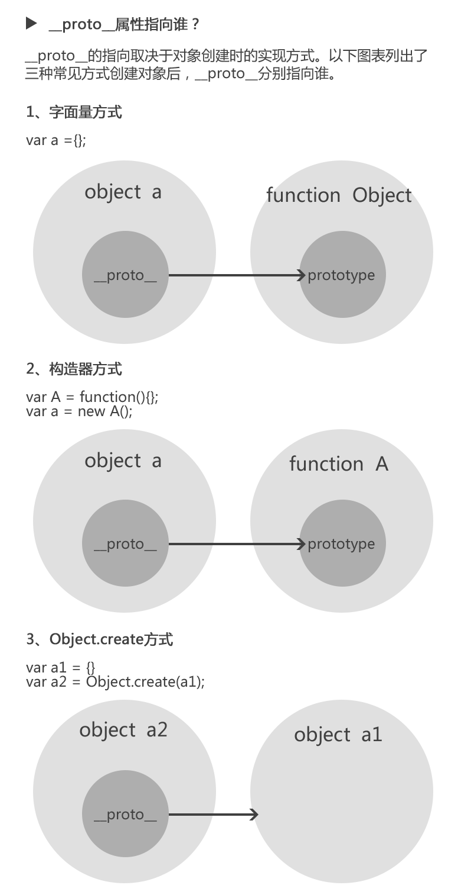

### 原型对象与原型链、继承详解

#### 1. **原型对象与原型链、继承（_重点内容_）**
1. prototype和__proto__的区别

    

    ```js
    var a = {};
    a.prototype     // undefined
    a.__proto__     // Object {}

    var b = function() {};
    b.prototype     // b {}
    ```
2. __proto__属性指向谁

    

    ```js
    // 1. 字面量方式
    var a = {};
    a.__proto__                                 // Object {}
    a.__Proto__ === a.constructor.prototype;    // true

    // 2. 构造器方式
    var A = function() {};
    var a = new A();
    a.__proto__                                 // A {}
    a.__proto__ === a.constructor.prototype;    // true

    // 3. Object.create()方式
    var a1 = {a: 1};
    var a2 = Object.creat(a1);
    a2.__proto__;                               // Object {a: 1}
    a2.__proto__ === a.constructor.prototype    // false（此处即为图1中的例外情况）
    ```
3. 什么是原型链

    

    ```js
    var A = function() {};
    var a = new A();
    a.__proto__;                                // A {} (即构造器function A 的原型对象)
    a.__proto__.__proto__;                      // Object {} (即构造器function Object 的原型对象)
    a.__proto__.__proto__.__proto__;            // null
    ```
    
    

    图中由相互关联的原型组成的链状结构就是原型链，也就是蓝色的这条线。


#### 2. 确定原型和实例的关系
* 通过`instanceof`操作符，用来测试实例与原型链中出现过的构造函数，结果就会返回`true`
    ```js
    instance instanceof Object;         // true
    instance instanceof SuperType;      // true
    ```
* 使用`isPrototypeOf()`方法。只要是原型链中出现过的原型，都可以说是该原型链所派生出的实例的原型，`isPrototypeOf()`方法会返回`true`
    ```js
    Object.prototype.isPrototypeOf(instance);       // true
    SuperType.prototype.isPrototypeOf(instance);    // true
    ```
#### 3. 谨慎定义方法

通过原型链实现继承时，不能使用对象字面量创建原型方法，因为这会重写原型链。
```js
// SubType 继承了 SuperType
SubType.prototype = new SuperType();
// 使用对象字面量添加新方法，会导致上一行代码无效
SubType.prototype = {
    getSubValue: function() {
        return this.subproperty
    },
    someOtherMethod: function() {
        return false;
    }
}
```

#### 4. 原型的实际应用
```html
<!-- index.html -->
<!DOCTYPE html>
<html>
<head>
    <title>Home</title>
</head>

<body>
    <p>zepto test 1</p>
    <p>zepto test 2</p>
    <p>zepto test 3</p>
    <div id="div1">
        <p>zepto test in div</p>
    </div>
    <script src="js/my-zepto.js"></script>
    <script type="text/javascript">
        var $p = $('p')
        $p.css('font-size', '40px')
        alert($p.html())

        var $div1 = $('#div1')
        $div1.css('color', 'blue')
        alert($div1.html())
    </script>
</body>
</html>
```

1. 在jQuery中的使用
    ```js
    // my-jquery.js
    (function (window) {

        var jQuery = function (selector) {
            return new jQuery.fn.init(selector)
        }

        // 为什么将方法集成到jQuery.fn上
        // 1. 方便后期插件扩展，和使用
        // 2. 最终只暴露出$，不污染全局变量
        jQuery.fn = {
            css: function (key, value) {
                alert('css')
            },
            html: function (value) {
                return 'html'
            }
        }

        var init = jQuery.fn.init = function (selector) {
            var slice = Array.prototype.slice
            var dom = slice.call(document.querySelectorAll(selector))

            var i, len = dom.length ? dom.length : 0
            
            // 将节点元素放到this下，方便访问
            for (i = 0; i < len; i++) {
                this[i] = dom[i]
            }
            this.length = len
            this.selector = selector
        }

        init.prototype = jQuery.fn

        window.$ = jQuery
    })(window)
    ```

2. 在zepto中的使用
    ```js
    // my-zepto.js
    (function (window) {
        var zepto = {}

        function Z(dom, selector) {
            var i,
                len = dom.length ? dom.length : 0
            
            for (i = 0; i < len; i++) {
                this[i] = dom[i]
            }
            this.length = len
            this.selector = selector || ''
        }

        zepto.Z = function (dom, selector) {
            return new Z(dom, selector)
        }

        zepto.init = function (selector) {
            var slice = Array.prototype.slice
            var dom = slice.call(document.querySelectorAll(selector))
            
            return zepto.Z(dom, selector)
        }

        var $ = function (selector) {
            return zepto.init(selector)
        }

        window.$ = $

        $.fn = {
            css: function (key, value) {
                alert('css')
            },
            html: function (value) {
                return '这是一个模拟的html'
            }
        }
        Z.prototype = $.fn

    })(window)
    ```

3. 插件机制和原型的可扩展性
    在jQuery中可以通过
    ```js
    $.fn.xxx = function () {
        // todo...
    }
    ```
    扩展原型方法

    jQ和zepto的插件机制，都体现出了原型的可扩展性