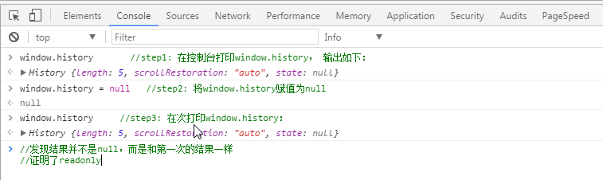
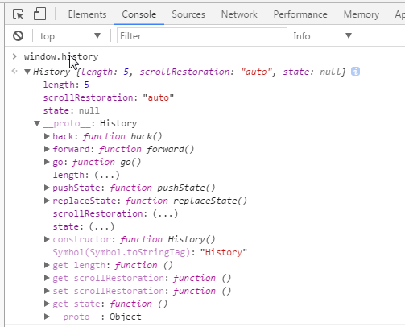
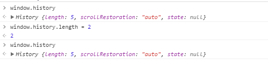
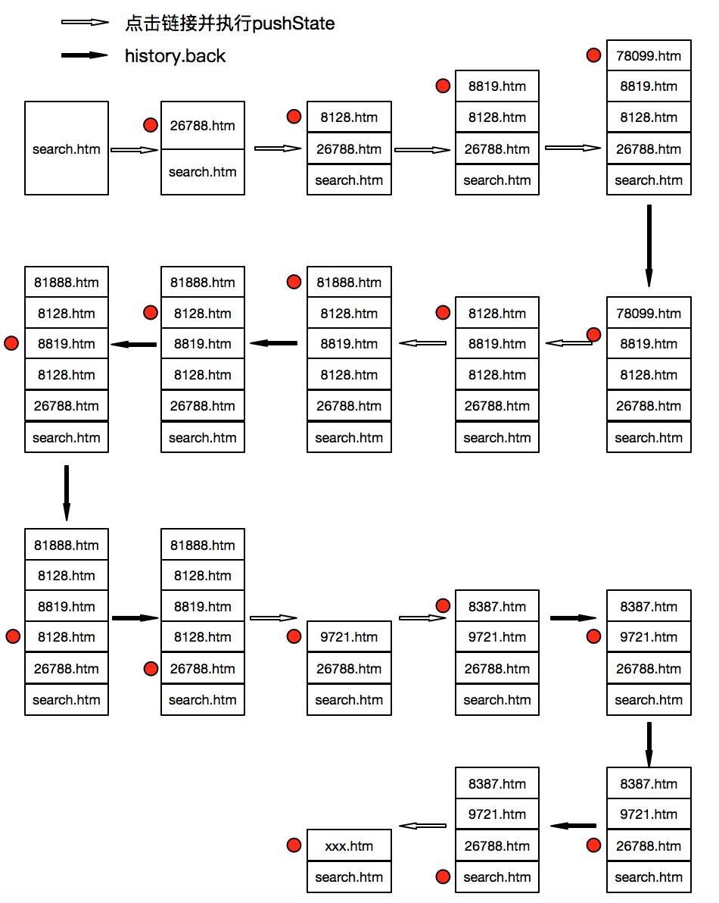

## Hash、History & 前端路由模式

### 1. 什么是路由 & router和route的区别

简单来说，路由就是URL到函数或者资源的映射。

router可以理解为一个容器，或者说一种机制，它管理了一组route。而route只是URL和函数的映射，在接收到一个URL之后，去路由映射表中查相应的函数，这个过程是由router处理的。

### 2. Hash模式
1. `location.hash`获取hash，hash值的变化不会重新加载页面
2. `hashchange`可监听hash变动
    ```js
    window.addEventListenner('hashchange', funcRef, false)
    ```
3. hash变动，可在history中添加一条记录，同时也意味着可以使用浏览器的前进后退按钮控制hash切换。

### 3. History模式

#### a. window.history基础详解
1. history实例



2. 操作session级别的url

    history内部有一个栈，当然这个栈是不可见的（处于安全考虑）。这个栈用来存放当前浏览器session级别的（关闭前）同一个tab所有访问过的url

    

    history对象并没有暴露存放历史url的属性。所以我们并不能通过类似如下方法操作会话历史：
    ```
    window.history.urlList = "http://www.***.com"
    ```

    可通过以下属性和方法来操作浏览器的会话历史

    1. length属性：记录进入会话历史的url的数目，注意是readonly!

        

    2. back，forward方法：调用此方法相当于点击浏览器的后退和前进按钮（此方法忽视一切参数）

    3. go方法：可加载历史列表中的某个具体的页面

    4. state: 一个与指定网址相关的状态对象，popstate事件触发时，该对象会传入回调函数。只读属性，不能直接修改，可以通过pushSate和replaceState操作

    5. **pushState 在history栈中添加一个新的记录。**
        ```js
        window.history.pushstatus(stateObject, title, URL)
        ```
        依次接受三个参数：

        1. `state`: 一个与添加的记录相关联的状态对象，主要用于popstate事件。该事件触发时，该对象会传入回调函数。也就是说，浏览器会将这个对象序列化以后保留在本地，重新载入这个页面的时候，可以拿到这个对象。如果不需要这个对象，此处可以填`null`

        2. 新页面的标题。但是，现在所有浏览器都忽视这个参数，所以这里可以填`null`

        3. 新的网址，必须与当前页面处在同一个域。浏览器的地址栏将显示这个网址。

        * `pushState()`方法不会触发页面刷新，只是导致 History 对象发生变化，地址栏会有反应

        * 如果pushState的 URL 参数设置了一个新的锚点值（即hash），并不会触发hashchange事件。反过来，如果 URL 的锚点值变了，则会在 History 对象创建一条浏览记录
            ```js
            history.pushState({foo: 'bar'}, 'page title', 'test.html#aink');
            ```

        * 如果`pushState()`方法设置了一个跨域网址，则会报错。
            ```js
            history.pushState(null, '', 'https://twitter.com/hello');
            ```
            pushState想要插入一个跨域的网址，导致报错。这样设计的目的是，防止恶意代码让用户以为他们是在另一个网站上，因为这个方法不会导致页面跳转。

    6. **replaceState 在history栈中替换当前记录，其他和pushState一样**

    7. popstate 事件

        每当同一个文档的浏览历史（即history对象）出现变化时，就会触发`popstate`事件。

        注意，仅仅调用`pushState()`方法或`replaceState()`方法 ，并不会触发该事件.

        ```js
        // 可以为popstate事件指定回调函数
        window.onpopstate = function (event) {
            console.log('state: ' + JSON.stringify(event.state));
        };
        ```

    8. **ScrollRestoration**: 前进后退时滚动条的位置。可修改属性，属性值：

        auto: 默认，保留上一次的滚动条位置。        
        manual： 滚动条位置为初始化位置（垂直方向置顶，水平方向最左边）
    
#### b. 浏览器历史记录策略和History API的关系



结论：
1. 浏览器针对每个页面维护一个History栈，执行`pushStatus()`可压入特定的url至栈顶，同时修改当前指针；
2. 执行`back()`操作时，栈的大小`（history.length）`并不会改变，仅仅移动指针的位置。
3. 若当前指针在栈的中间位置（非栈顶），执行`pushStatus()`会改变栈的大小；

### 4. 两种模式的路由简易实现
1. history模式
    ```html
    <!-- index.html -->
    <div class="menu">
        <a class="nav-item" href="/">home</a>
        <a class="nav-item" href="/profile">profile</a>
        <a class="nav-item" href="/articles">articles</a>
    </div>
    <div class="content"></div>
    ```
    ```js
    // index.js
    const $ = (selector) => document.querySelector(selector)

    class Router {
        constructor(routeMap) {
            this.routeMap = routeMap
            this._bindPopState()
        }
        init(path) {
            path = Router.realPath(path)
            history.replaceState({ path }, '', path)
            this.routeMap[path] && this.routeMap[path]()
        }
        push(path) {
            path = Router.realPath(path)
            history.pushState({ path }, '', path)
            this.routeMap[path] && this.routeMap[path]()
        }
        _bindPopState() {
            window.addEventListener('popstate', (e) => {
                const path = e.state && e.state.path
                this.routeMap[path] && this.routeMap[path]()
            })
        }
        static realPath(path) {
            // 这里可以配合 path-to-regexp 做更完善的路由检测
            if (path !== '/' && path.slice(-1) === '/') {
                path = path.match(/(.+)\/$/)[1]
            }
            return path
        }
    }
    const routeMap = {
        '/': () => {
            const $content = $('.content')
            $content.innerHTML = '这里是首页'
        },
        '/profile': () => {
            const $content = $('.content')
            $content.innerHTML = '这里是用户信息'
        },
        '/articles': () => {
            const $content = $('.content')
            $content.innerHTML = '这里是文章列表'
        }
    }

    // 页面使用方式
    let router = new Router(routerMap)
    router.init(location.pathname)

    $('.menu').addEventListener('click', (e) => {
        e.preventDefault()
        if (e.target.tagName === 'A') {
            router.push(e.target.getAttribute('href'))
        }
    })
    ```

2. hash模式
    ```js
    class Router {
        constructor(routerMap) {
            this.routerMap = routerMap
            this._bindHashChange()
        }
        init(path) {
            path = Router.realPath(path)
            this.routerMap[path] && this.routerMap[path]()
        }
        push(path) {
            location.hash = `#${path}`
            this.routerMap[path] && this.routerMap[path]()
        }
        _bindHashChange() {
            window.addEventListener('hashchange', () => {
                const path = Router.realPath(location.hash)
                this.routerMap[path] && this.routerMap[path]()
            })
        }
        static realPath(path) {
            return path.slice(1) || '/'
        }
    }
    ```

### 5. 对比两种路由模式
* Hash模式，兼容性更好
* History模式更正式，设置的URL可以是与当前URL同源的任意URL；而hash只可以修改#后面的部分，故只可设置与当前同文档的URL
* Hash模式仅改变hash部分内容，而hash部分是不会包含在HTTP请求中的，因此不需要对服务器端做特殊改动：
    ```
    http://oursite.com/#/user/id   // 如重新请求只会发送http://oursite.com/
    ```
    而History模式则会修改得和正常请求后端的URL一样.
    ```
    http://oursite.com/user/id
    ```
    因此服务器端需要增加一个覆盖所有情况的候选资源。如果 URL 匹配不到任何静态资源，则应该返回同一个 index.html 页面，这个页面就是 app 依赖的页面。同时服务器端这么做之后，就不会再返回404错误页面，因为对于所有路径都会返回index.html。为了避免这种情况，需要在前端路由中增加一个覆盖所有路由的情况，返回404页面。

### 6. 引用

[History 对象（阮一峰）](https://wangdoc.com/javascript/bom/history.html)

[history实现一个前端路由](https://xwjgo.github.io/2017/08/29/history%E5%AE%9E%E7%8E%B0%E5%89%8D%E7%AB%AF%E8%B7%AF%E7%94%B1/)

[【源码拾遗】从vue-router看前端路由的两种实现](https://zhuanlan.zhihu.com/p/27588422)