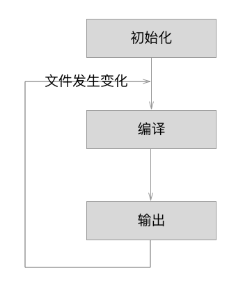

## webpack详解
TODO: 具体内容待填充...
### 一. webpack是什么
1. 和gulp，grunt区别

### 二. 基本使用

#### 1. npm script命令

#### 2. devtool 和 sourcemap

#### 3. webpack-dev-server 本地开发服务器

#### 4. 生产环境
`cross-env`设置环境变量的跨平台解决方案

#### 5. webpack-merge 多文件配置

#### 6. Loaders

1. style-loader（将css代码混合到js模块当中）

#### 7. plugins
1. Hot Module Replacement（HMR 模块热替换）
2. SplitChunks（抽取出通用代码模块）
3. MiniCssExtractPlugin （将css代码单独提取成文件）
4. ProvidePlugin （可以将jquery等常用类库设置全局变量）

#### 8. `import()`动态引入，懒加载
webpack将会把`import()`引入的模块单独打包成文件，按需引入

#### 9. 缓存
使用`[chunkhash]`

### 三. 流程详解
`Webpack`的运行流程是一个串行的过程，从启动到结束会依次执行以下流程：

#### 1. 流程概括
1. **初始化参数**：从配置文件和`Shell`语句中读取和合并参数，得出最终参数；
2. **开始编译**：用上一步得到的参数初始化`Compiler`对象，加载所有配置的插件，执行run方法，开始执行编译；
3. **确定入口**：根据配置中的`entry`找出所有入口文件；
4. **编译模块**：从入口文件出发，调用所有配置的`Loader`对模块进行翻译，再找出该模块依赖的模块，再递归本步骤直到所有入口依赖的文件都经过了本步骤的处理；
5. **完成模块编译**：在经过的第4步使用`Loader`翻译完所有模块后，得到了每个模块被翻译后最终的内容以及它们之间的依赖关系；
6. **输出资源**：根据入口和模块之间的依赖关系，组装成一个个包含多个模块的`Chunk`，再把每个`Chunk`转换成一个单独的文件加入到输出列表，这步是可以修改输出内容的最后机会；
7. **输出完成**：在确定好输出内容后，根据配置确定输出的路径和文件名，把文件内容写到文件系统。

在以上过程中，`Webpack`会在特定的时间点广播出特定的事件，插件在监听到感兴趣的事件后执行特定的逻辑，并且插件可以调用`Webpack`提供的API，改变`Webpack`的运行结果。

#### 2. 流程细节
1. **初始化**：启动构建，读取和合并配置参数，加载`Plugin`，实例化`Compiler`。
2. **编译**：从`Entry`出发，针对每个`Module`串行调用对应的Loader去翻译文件内容，再找到该`Module`依赖的`Module`，递归地进行编译处理。
3. **输出**：对编译后的`Module`组合成`Chunk`，把`Chunk`转换成文件，输出到文件系统。

### 四. 最佳实践

### 五. 引用
[webpack原理（《深入浅出 webpack》）](https://webpack.wuhaolin.cn/5%E5%8E%9F%E7%90%86/5-1%E5%B7%A5%E4%BD%9C%E5%8E%9F%E7%90%86%E6%A6%82%E6%8B%AC.html)

[Webpack 3，从入门到放弃 (官方文档内容)](https://segmentfault.com/a/1190000010871559#articleHeader24)