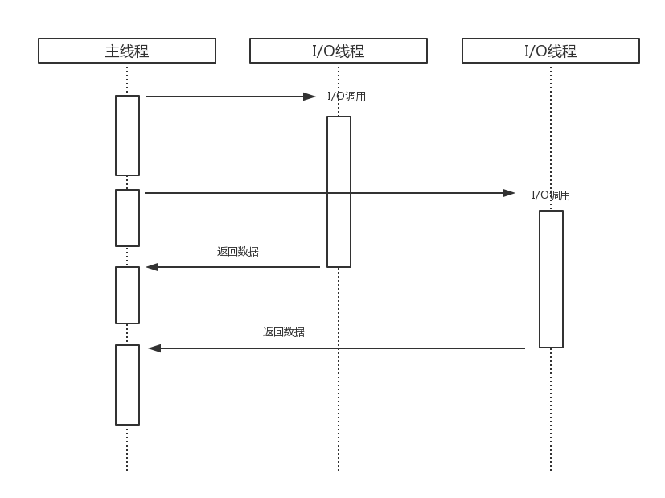
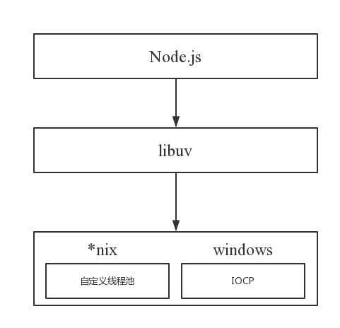
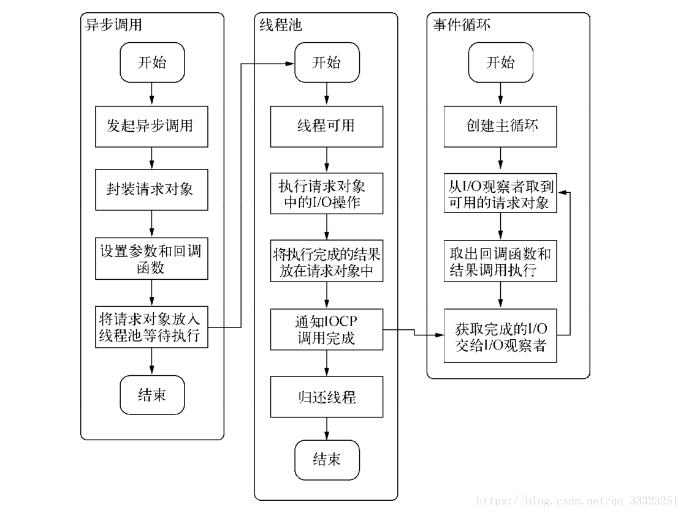
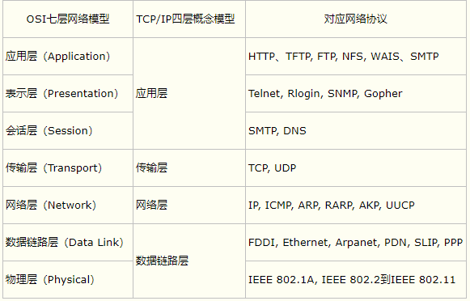

### 《深入浅出node.js》学习笔记

#### 预备知识

##### 1. npm
```
// 命令对应的相关使用帮助
$ npm <commond> -h
```

```
// 查看对应模块的package.json文件以及npm仓相关属性
$ npm view socket.io
```

##### 2. JavaScript对应基础知识
1. 函数的参数数量

    函数有个很有意思的属性——参数数量，该属性指明函数声明时可接受的参数数量
    ```js
    var a = function(a, b, c) {};
    a.length == 3   // true
    ```
    尽管在浏览器端很少使用，但非常重要，很多流行的Node.js框架就是通过此属性根据不同参数个数提供不同的功能

##### 4. Node中的js
1. 在默认情况下，每个模块都会暴露出一个空对象。如果想在该对象上添加属性，那么使用`exports`即可。
    ```js
    exports.name = 'john';
    exports.data = 'this is some data';

    var privateVariable = 5;

    exports.getPrivate = function() {
        return privateVariable;
    };
    ```
    或者，彻底重写`module.exports`
    ```js
    // module.js
    function Person(name) {
        this.name = 'Tom';
    };

    Person.prototype.talk = function() {
        console.log('name:', this.name);
    };

    module.exports = Person;

    // main.js
    var Person = require('./module_a');

    var tom = new Person();
    tom.talk();
    ```

##### 5. 命令行工具(CLI)以及FS API
1. Node.js 文件系统（fs 模块），是唯一一个同时提供同步和异步API的模块。

    例如读取文件内容的函数有异步的 `fs.readFile()` 和同步的 `fs.readFileSync()`。

    建议大家使用异步方法，比起同步，异步方法性能更高，速度更快，而且没有阻塞。

2. 流

    process全局对象中包含了三个流对象，分别对应对应三个UNIX标准流：
    * ** stdin **   :   标准输入
    * ** srdout **  :   标准输出
    * ** stderr **  :   标准错误
    简而言之，当持续不断地对数据进行读写时，流就出现了。

3. ANSI转义码
    ```js
    console.log('\033[90m' + '这里是一段文本' + '\033[39m');
    ```
    * \033表示转义序列的开始
    * [表示开始颜色设置
    * 90表示前景色为灰亮色
    * m表示颜色设置结束

3. Stream

    `fs.createReadStream`方法允许为一个文件创建一个可读的stream对象   
    例如：要上传一个很大的文件到web服务器，这是你无需读取完所有的文件内容在开始上传，使用stream可以大大提速上传过程。
    ```js
    // 必须等到文件读取完毕，载入到RAM，才能处理
    var stream = fs.readFile('input.txt', function(err, contents) {
        // 对文件进行处理
    });

    // 每次读取可变大小的内容快，并且每次读取后触发回调函数
    var stream = fs.createReadStream('input.txt');
    stream.on('data', function(chunk) {
        // 处理文件部分内容
    });
    stream.on('end', function(chunk) {
        // 文件读取完毕
    });
    ```
    
4. 监视

    Node允许监视文件或目录是否发生变化。发生变化时，分发一个事件，触发指定的回调函数。
    ```js
    var stream = fs.createReadStream('test.txt');

    var files = fs.readdirSync(process.cwd());
    files.forEach(function(file) {
        if (/\.css/.test(file)) {
            fs.watchFile(process.cwd() + '/' + file, function() {
                console.log('  -  ' + file + 'changed!');
            });
        }
    });
    ```
    除`fs.watchFile`之外，还可以使用`fs.watch`来监视整个目录。

##### 7. HTTP
HTTP属于TCP上层协议
1. HTTP结构

    发送数据块的方式在涉及文件系统的情况下会非常高效。因为Node允许以数据块的形式往响应中写数据，同时它又允许以数据块的形式读取文件。所以可以使用ReadStream文件系统API来实现如图片等文件的读写。优点：
    * 高效的内存分配。要是对每个请求在写入前都完全把图片信息读取完（通过fs.readFile），在处理大量请求时会消耗大量内存。
    * 数据一旦就绪就可以立即写入了。
2. 连接

    TCP服务器和HTTP服务器的实现，都调用了`createServer`方法，但它们有本质区别，即回调函数中对象的类型。在net服务器中，是个连接（connection）对象，而在HTTP服务器中，则是请求和响应对象。原因：
    1. HTTP服务器是更高层的API，提供了控制和HTTP协议相关的一些功能。
    2. 浏览器在访问站点时不会就只用一个连接。很多主流浏览器为了更快加载网站内容，能向同一个主机打开八个不同的连接，并发送请求。   
        尽管我们可以通过`req.connection`获取TCP连接对象，Node为了不让我们担心到底是请求还是连接，为我们提供了请求和响应的抽象。因此，即使你能通过`req.connection`获取TCP连接对象，但大多数情况下你还是在与请求和响应的抽象打交道。

##### 8. Connect
Connect是基于http模块的中间件框架。

[Connect框架官方文档](https://www.npmjs.com/package/connect)

[Connect第三方的中文文档（部分内容已过时，许多中间件已被废弃，仅做参考）](http://blog.fens.me/nodejs-connect/)

1. 关于中间件

    中间件由函数组成，除了处理req和res对象之外，还接收一个next函数来做流程控制。
    1. 书写可重用的中间件
        ```js
        // middleware.js
        module.exports = function (opts) {
            // ...
            return function (req, res, next) {
                // ...
                next();
            }
        };
        ```
        ```js
        // server.js
        var middleware = require('./middleware');

        app.use(middleware(opts));
        ```
        模块暴露一个函数，函数本身又返回一个函数，这对于可配置的中间件来说是非常常见的写法。   
        最后，总是要让其他中间件能够处理请求，所以得调用next。否则程序不会做任何事情！

2. Connect中的中间件

    虽然在Connect和Express或者其他框架下使用中间件的方式略微不同。但这些平台框架都会提供具有相似功能，解决同一类问题的中间件。
    1. static

        在旧版中，Connect自身提供static中间件，用于处理静态文件，设置root路径作为静态文件服务器，但已经被废弃。   
        目前是使用`serve-static`，作为静态文件的处理中间件
        ```js
        // 引入
        var serveStatic = require('serve-static');

        // 通过use使用
        app.use(serveStatic(__dirname + '/website'));
        ```
        1. 挂载

            `static`允许将任意一个URL匹配到文件系统中的任意一个目录。
            ```js
            app.use('/static', serveStatic('/path/res/website'));

            // 现在，可以访问位于 website 目录中的文件了
            http://localhost:3000/static/images/kitten.jpg
            http://localhost:3000/static/css/style.css
            http://localhost:3000/static/js/app.js
            ``` 
        2. maxAge(最大缓存时间)

            资源在客户端缓存的最大时间
    2. query中间件

        解析查询url中的字符串，query中间件在Express中默认就是启用的。
    3. ...还有很多中间件，用到再查文档

3. session会话和Redis session

    大多数web应用中，多个请求之间共享“用户会话”的概念是非常必要的。“登录”一个网站时，多多少少会使用某种形式的会话系统，它主要通过在浏览器中设置cookie来实现，该cookie信息会在随后所有的请求头信息中被带回到服务器。

    尝试一件事情：开启一段session会话，登陆后，重启node服务器，然后刷新浏览器，注意到没有，session丢了！

    原因就在于session默认的存储方式是在内存。这就意味着session数据都是存储在内存中的，当进程退出后，session数据自然也就丢失了。所以我们需要一种能够将session信息持久化存储下来的机制，如Redis。

##### 9. 其它
1. 不同平台下的文件路径
```js
var publicPath = path.resolve(__dirname, "public"); 
```
为什么使用 `path.resolve` ？
之所以不直接使用 `/public` 是因为 `Mac` 和 `Linux` 中目录为 `/public` 而 `Windows` 使用万恶的反斜杠 `\public` 。`path.resolve` 就是用来解决多平台目录路径问题。

2. Mongoose
    1. 如果没有对 Mongo 的服务端口号进行修改，那默认将使用 27017 端口


#### 第一章 node简介

##### 1. 单线程
单线程的缺点
* 无法利用多核CPU
* 错误会引起整个应用退出，应用的健壮性值得考验
* 大量计算占用CPU导致无法继续调用异步I/O
像浏览器中JavaScript与UI公用一个线程一样，JavaScript长时间执行会导致UI的渲染和响应被中断。

Node采用了与Web Workers相同的思路来解决单线程中大计算量的问题：`child_process`

#### 第二章 模块机制

##### 1. CommonJS的模块规范
1. 【模块引用】
    `require()`方法，这个方法接受模块标识，以此引入一个模块的API到当前的上下文中
2. 【模块定义】
    上下文中提供了`exports`对象用于导出当前模块的方法或者变量，并且它是唯一导出的出口。在模块中，还存在一个`module`对象，它代表模块本身，而`exports`是`module`的属性。在Node中，一个文件就是一个模块，将方法挂载在`exports`对象上作为属性即可定义导出的方式
3. 【模块标识】
    `require()`方法的参数，必须是符合**小驼峰命名**的字符串，可以没有文件名后缀`.js`。

    每个模块具有独立的空间，它们互不干扰。

模块应用代码示例：
```javascript
// math.js
exports.add = function () {
    var sum = 0,
        i = 0,
        args = arguments,
        l = args.length;
    while (i < l) {
        sum += args[i++];
    }
    return sum;
};

// program.js
var math = require('math');
exports.increment = function (val) {
    return math.add(val, 1);
};
```

##### 2. Node的模块实现

Node模块分为两类：一类是Node提供的模块，核心模块；另一类的用户编写的模块，文件模块

模块引入流程：缓存加载 => 路径分析 => 文件定位 => 编译执行

1. 优先从缓存加载

    Node引入过的模块都会进行缓存，以减少二次引入时的开销。不同于浏览器的静态脚本缓存，浏览器只缓存文件，而Node缓存的是编译和执行之后的对象。因此，二次引入时也就不需要分析路径、文件定位和编译执行的过程，大大提高了再次加载模块时的效率。

    核心模块的缓存检查先于文件模块的缓存检查。
2. 路径分析和文件定位

    1. 模块标识符在Node中主要分为以下几类
        * 核心模块，如http、fs、path等
        * .或..开始的相对路径文件模块
        * 以/开始的绝对路径文件模块
        * 非路径形式的文件模块，如自定义的`connect`模块

    2. 【路径形式的文件模】在加载过程中，Node会逐个尝试模块路径中路径，直到找到目标文件为止。因此，当前文件路径越深，模块查找耗时会越多，这是自定义模块的加载速度是最慢的原因。
    3. 【文件扩展名分析】当标识符中不包含文件扩展名，Node会按照`.js、.json、.node`的次序补足扩展名，依次尝试。

        因为Node是单线程，所以这里会引起性能问题。

        **_解决方案一_**：如果是`.node和.json`文件，在传递给`require()`的标识符中带上扩展名，会加快一点速度。

        **_解决方案二_**：同步配合缓存，可以大幅缓解Node单线程中阻塞式调用的缺陷。
3. 模块编译

    每一个编译成功的模块都会将其文件路径作为索引缓存在`Module._cache`对象上，以提高二次引入的性能。

    1. JS模块的编译

        在编译过程中，Node对获取的JavaScript文件内容进行了头尾包装。在头部添加了`(function (exports, require, module, __filename, __dirname) {\n, 在尾部添加了\n})`。

        一个正常的JS文件会被包装成如下的样子：
        ```js
        (function (exports, require, module, __filename, __dirname) {
           var math = require('math');
           exports.area = function(radius) {
               return Math.PI * radius * radius;
           };
        });
        ```

        每个模块之间都进行了作用域隔离。包装后的代码会通过vm原生模块的`runInThisContext()`方法执行，返回一个具体的function对象。最后，将当前模块对象的exports属性、require()方法、module，以及在文件定位中得到的完整路径和文件目录作为参数传递给这个function()执行。

        在执行之后，模块的exports属性被返回给了调用方。exports属性上的任何方法和属性都可以被外部调用到，但模块中的其余属性或方法则不可以直接被调用。

        这就是Node对CommonJS模块规范的实现。

4. 模块调用栈
    C/C++内建模块属于最底层的模块，它属于核心模块，主要提供API给JavaScript核心模块和第三方JS文件模块调用。如果你不是非常了解要调用的C/C++内建模块，请尽量避免通过process.binding()方法直接调用，这是不推荐的。

    

5. 兼容多种模块规范
    ```js
    (function (name, definition) {
        // 检查上下文环境是否为AMD或CMD
        var hasDefine = typeof define === 'function',
            // 检查上下文环境是否为Node
            hasExports = typeof module !== 'undefined' && module.exports;

        if (hasDefine) {
            // AMD 环境 or CMD 环境
            define('definition');
        } else if (hasExports) {
            // Node.js 模块
            module.exports = definition();
        } else {
            // 将模块的执行结果挂在window变量中，在浏览器中this指向window对象
            this[name] = definition();
        }
    })('hello', function () {
        var hello = function () { };
        return hello;
    });
    ```

#### 第三章 异步I/O

>  PHP与Node在基础架构上有明显区别。Node采用一个长期运行的进程，相反，Apache会产出多个线程（每个请求一个线程），每次都会刷新状态。在PHP中，当解释器再次执行时，变量会被重新赋值，而Node则不然。因此，在Node中，需要对回调函数如何修改当前内存中的变量（状态）特别小心。

##### 1. 现实的异步I/O
我们时常提到Node是单线程的，这里的单线程仅仅是JS执行在单线程中罢了。在Node中，无论是*nix还是Windows平台，内部完成I/O任务的另有线程池。



由于Windows平台和*nix平台的差异，Node提供了libuv作为抽象封装层，使得所有平台兼容性的判断都由这一层来完成，并保证上层的Node与下层的自定义线程池及IOCP之间各自独立。



##### 2. Node的异步I/O

1. 事件循环

    事件轮询是Node IO的基础核心。许多优秀的Node模块都是非阻塞的，执行任务也都采用了异步的方式。

2. 观察者

    浏览器采用了类似的机制。事件可能来自用户的点击或者加载某些文件时产生，而这些产生的事件都有对应的观察者。在Node中，事件主要来源于网络请求、文件I/O等。

    事件循环是一个典型的生产者/消费者模型。在Windows下，这个循环基于IOCP创建。而*nix下则基于多线程创建。

3. 请求对象

4. 执行回调

    整个异步I/O的流程

    

##### 3. 非 I/O 的异步API
1. 定时器

    `setTimeout()`和`setInterval()`与浏览器中的API是一致的。它们的实现原理与异步I/O比较类似，只是不需要I/O线程池的参与。调用`setTimeout()`或者`setInterval()`创建的定时器会被插入到定时器观察者内部的一个红黑树中。每次Tick执行时，会从该红黑定时器中迭代取出定时器对象，检查是否超过定时时间，如果超过，就形成一个事件，它的回调函数将立即执行。

    定时器的问题在于，它并非准确的。尽管事件循环十分快，但如果某一次循环占用的时间较多，那么下一次循环时，它也许已经超时很久了。

2. process.nextTick()

    采用定时器需要动用红黑树，创建定时器对象和迭代等操作，而`setTimeout(fn, 0)`的方式较为浪费性能。`process.nextTick()`方法的操作较为轻量。

##### 4. 事件驱动的高性能服务器
Node通过事件驱动的方式处理请求，无需为每一个请求创建额外的对应线程，可以省掉创建线程和毁掉线程的开销，同时操作系统在调度任务时因为线程较少，上下文切换的成本很低。这使得服务器能有条不紊得处理请求，即使在大量连接的情况下，也不受线程上下文切换的影响，这是Node高性能的一个原因。

Node具有与Nginx相同的特征，不同之处在于Nginx采用纯C写成，性能较高，但它仅适合于做web服务器，用于反向代理或负载均衡等服务，在处理具体业务方面较为欠缺。

#### 第四章 异步编程
（TODO: 关于异步编程模式，promise，async，await后续补充）

##### 1. 异步编程解决方案
1. 事件发布/订阅模式
Node自身提供events模块

    ```js
    // 订阅
    emitter.on('event1', function (msg) {
        console.log(msg);
    });
    // 发布
    emitter.emit('event1', 'hello');
    ```
    1. 如果对一个事件添加了超过10个侦听器，将会得到一条警告。这一设计与Node自身单线程运行有关，设计者认为侦听器太多可能会导致内存泄漏，所以存在这样一条警告。调用`emitter.setMaxListeners(0)`；可以将这个限制去掉。

    2. 为了处理异常，EventEmitter对象对error事件进行了特殊对待。如果外部没有捕获这个异常，将会引起线程退出。一个健壮的EventEmitter实例应该对error事件做处理。

    3. 继承events模块

        ```js
        var events = require('events');
        var util = require('util');

        function Stream () {
            events.EventEmitter.call(this);
        }
        util.inherits(Stream, events.EventEmitter);
        ```

    4. 利用事件队列解决雪崩问题

        ```js
        var events = require('events');

        /**
        * 数据库查询
        */
        var select = function (callback) {
            db.select('SQL', function (results) {
                callback(results);
            });
        };

        /**
        * 添加状态锁
        * 问题：连续多次调用select()时，只有第一次调用是生效的，
        * 后续的select()是没有数据服务的
        */
        var status = 'ready';
        var select = function (callback) {
            if (status === 'ready') {
                status = 'pending';
                db.select('SQL', function (results) {
                    status = 'ready';
                    callback(results);
                });
            }
        };

        /**
        * 利用events模块once()方法
        */
        var proxy = new events.EventEmitter();
        var status = 'ready';
        var select = function (callback) {
            proxy.once('selected', callback);
            if (status === 'ready') {
                status = 'pending';
                db.select('SQL', function (results) {
                    proxy.emit('selected', results);
                    status = 'ready';
                });
            }
        };
        ```
        
        利用once()方法，将所有请求的回调都压入事件队列中，利用其执行一次就将监视器移除的特点，保证每一个回调只被执行一次。

        SQL在进行查询时，新到来的相同调用只需在队列中等待数据就绪即可，得到结果可以被这些调用共同使用。

    5. 多异步之间的协作方案

        利用偏函数处理哨兵变量和第三方函数的关系。

        ```js
        var after = function (times, callback) {
            var count = 0, results = {};
            return function (key, value) {
                results[key] = value;
                count++;
                if (count === times) {
                    callback(results);
                }
            };
        };

        var emitter = new EventSource.Emitter();
        var done = after(times, render);

        emitter.on('done', done);
        emitter.on('done', others);

        fs.readFile(remplate_path, 'utf-8', function (err, template) {
            emitter.emit('done', 'template', template);
        });

        db.query(sql, function (err, data) {
            emitter.emit('done', 'data', data);
        });

        l10n.get(function (err, resources) {
            emitter.emit('done', 'resources', resources);
        });
        ```
        问题：这种方式需要额外维护一个`done()`函数，以及在回调函数中需要从结果中把数据一个一个提取出来，再进行处理。  

        优化一步解决方案：   
        [田老师的EventProxy模块](http://taobaofed.org/blog/2016/04/16/how-to-find-memory-leak/)

#### 第五章 内存控制

##### 1. V8的垃圾回收机制与内存限制

1. V8的内存限制

    在Node中通过js使用内存时就会发现只能使用部分内存（64位系统下约为1.4GB，32位系统下约为0.7GB）。在这样的限制下，将会导致Node无法直接操作大内存对象。

##### 2. 高效使用内存

1. 变量的主动释放

    如果是全局变量，由于全局作用域直到进程退出才能释放，此时将导致引用的对象常驻内存（常驻在老生代中）。如果需要释放常驻内存的对象，可以通过delete操作来删除引用关系。或将变量重新赋值。

    但在v8中通过delete删除对象的属性有可能干扰v8的优化，所以通过赋值方式解除引用更好。

2. 闭包

    闭包是js的高级特性。问题在于一旦有变量引用这个中间函数。这个中间函数将不会释放，同时也会使原始的作用域不会得到释放，作用域中产生的内存占用也不会得到释放。除非不再有引用，才会逐步释放。

正常的js执行中，无法立即回收的内存有闭包和全局变量引用这两种情况。

##### 3. 内存指标

Node的内存构成主要由通过V8进行分配的部分和Node自行分配的部分。受V8的垃圾回收限制的主要是V8的堆内存。

1. Buffer对象不同于其他对象，它不经过V8的内存分配机制，所以也不会有堆内存的大小限制。这也意味着利用堆外内存可以突破内存限制的问题。

##### 4. 内存泄漏

原因：1. 缓存  2. 队列消费不及时  3. 作用域未释放

1. 慎将内存当做缓存

    Node中，任何试图将内存当缓存的行为都应当被限制。

    1. 缓存限制策略

        为了解决缓存中的对象永远无法释放的问题，需要加入一种策略来限制缓存的无限增长（例如限制缓存数量，先进先出方式淘汰缓存...）。

        [node-lru-cache （Isaac Z. Schlueter采用LRU算法的缓存）](https://github.com/isaacs/node-lru-cache)

    2. 缓存的解决方案

        使用大量缓存，比较好的方案是使用进程外的缓存，进程自身不存储状态，不影响Node进程的性能。例如Redis和Memcached。

        1. 将缓存转移到外部，减少常驻内存的对象的数量，让垃圾回收更高效。

        2. 进程之间可以共享缓存。

2. 关注队列状态

    任意异步调用都应该包含超时机制，一旦在限定时间内未完成响应，通过回调函数传递超时异常，使得任意异步调用的回调都具备可控的响应时间，给消费速度一个下限值。

    解决方案：Bagpipe，async...

    [Bagpipe(风笛) github](https://github.com/JacksonTian/bagpipe/blob/master/README_CN.md)

    [Nodejs大批量下载图片入坑指南（使用async和bagpipe处理大并发量请求）](https://linghucong.js.org/2016/08/06/nodejs-batch-download-images-with-async-and-bagpipe/)

3. 内存泄漏排查

    TODO: 实际测试两种排查方案

    1. node-heapdump + Chrome Profiles

    2. node-memwatch

    [如何定位 Node.js 的内存泄漏（淘宝FED）](http://taobaofed.org/blog/2016/04/16/how-to-find-memory-leak/)

    [heapdump安装报错](https://blog.csdn.net/qq_28097847/article/details/78059762)

4. 大内存应用

    Node提供了stream模块，通过流的方式实现对大文件的操作。
    ```js
    var reader = fs.createReadStream('in.text');
    var writer = fs.createReadStream('out.txt');

    reader.on('data', function (chunk) {
        writer.writer(chunk);
    });
    reader.on('end', function () {
        writer.end();
    })


    // 简洁写法
    var reader = fs.createReadStream('in.text');
    var writer = fs.createReadStream('out.txt');
    reader.pipe(writer);
    ```
    可读流提供了管道方法`pipe()`，通过流的方式，上述代码不会受到V8内存限制的影响，有效提高程序的健壮性。

    如不需要进行字符串层面的操作，则不需要借助V8来处理，可以尝试进行纯粹的Buffer操作，这不会受到V8堆内存的限制。

#### 第六章 理解Buffer
TODO: 待补充

#### 第七章 网络编程

1. 构建TCP服务
    1. 特征
        1. 面向连接的通信和保证传递的顺序

            使用node来写一个TCP服务器，只要考虑连接和以及往套接字中写数据即可。接收方会按序接收到传输的信息，要是发生网络错误，连接会失效或者终止。
        2. 面向字节

            可以使用ASCII字符或者Unicode进行传输
        3. 可靠性
        4. 流控制
        5. 拥堵控制

    2. OSI七层协议

        

    3. TCP服务事件

        TCP 针对网络中的小数据包有一定的优化策略：Nagle算法。   
        如果每次只发送一个字节的内容而不优化，网络中将充满只有极少数有效数据的数据包，将十分浪费网络资源。Nagle算法针对这种情况，要求缓冲区的数据大到一定数量或者一定时间后才将其发出，所以小数据包将被Nagle算法合并。缺点是：数据有可能被延迟发送。

        在Node中，由于TCP默认启用了Nagle算法，可以调用`socket.setNoDelay(true)`去掉Nagle算法，使得write()可以立即发送数据到网络中。

2. 构建UDP服务

    1. UDP与TCP最大的不同是，UDP不是面向连接的。在UDP中，一个套接字可以与第一个UDP服务通信。

        问题：它提供面向事务的简单不可靠信息传输服务，在网络差的情况下存在丢包严重的问题。

        常常应用在那种偶尔丢一两个数据包也不会产生重大影响的场景，比如音频，视频等。DNS服务即使基于它实现的。

3. 构建WebSocket服务

    1. WebSocket的通信原理和机制

        1. 客户端：申请协议升级

            websocket本身虽然也是一种新的应用层协议，但是它也不能够脱离http而单独存在。具体来讲，我们在客户端构建一个websocket实例，并且为它绑定一个需要连接到的服务器地址，当客户端连接服务端的时候，会向服务端发送一个类似下面的http报文：

            ```js
            GET /webfin/websocket/ HTTP/1.1
            Host: localhost
            Connection: Upgrade // 表示要升级协议
            Upgrade: websocket  // 表示要升级到websocket协议
            // Sec-WebSocket-Key的值是随机生成的Base64编码的字符串，用于安全校验
            Sec-WebSocket-Key: xqBt3ImNzJbYqRINxEFlkg==
            Origin: http://localhost:8080
            Sec-WebSocket-Version: 13   // 表示websocket的版本
            ```

            这是一个http get请求报文，该报文中有一个upgrade首部，它的作用是告诉服务端需要将通信协议切换到websocket，如果服务端支持websocket协议，那么它就会将自己的通信协议切换到websocket，同时发给客户端类似于以下的一个响应报文头：

        2. 服务端：响应协议升级

            ```js
            HTTP/1.1 101 Switching Protocols
            Upgrade: websocket
            Connection: Upgrade
            // Sec-WebSocket-Accept的值是服务端采用与客户端一致的密钥计算出来后返回客户端的
            Sec-WebSocket-Accept: K7DJLdLooIwIG/MOpvWFB3y3FE8=

            // 备注：每个header都以\r\n结尾，并且最后一行加上一个额外的空行\r\n
            ```

            返回的状态码为`101`，表示同意客户端协议转换请求，并将它转换为websocket协议。以上过程都是利用http通信完成的，称之为websocket协议握手(websocket Protocol handshake)，进过这握手之后，客户端和服务端就建立了websocket连接，以后的通信走的都是websocket协议了。所以总结为websocket握手需要借助于http协议，建立连接后通信过程使用websocket协议。同时需要了解的是，该websocket连接还是基于我们刚才发起http连接的那个TCP连接。

            一旦建立连接之后，就可以进行数据传输了，websocket提供两种数据传输：文本数据和二进制数据。

        3. 数据帧格式

            详解有点绕，反正记不住，用到再查！

            ```
            0                   1                   2                   3
            0 1 2 3 4 5 6 7 8 9 0 1 2 3 4 5 6 7 8 9 0 1 2 3 4 5 6 7 8 9 0 1
            +-+-+-+-+-------+-+-------------+-------------------------------+
            |F|R|R|R| opcode|M| Payload len |    Extended payload length    |
            |I|S|S|S|  (4)  |A|     (7)     |             (16/64)           |
            |N|V|V|V|       |S|             |   (if payload len==126/127)   |
            | |1|2|3|       |K|             |                               |
            +-+-+-+-+-------+-+-------------+ - - - - - - - - - - - - - - - +
            |     Extended payload length continued, if payload len == 127  |
            + - - - - - - - - - - - - - - - +-------------------------------+
            |                               |Masking-key, if MASK set to 1  |
            +-------------------------------+-------------------------------+
            | Masking-key (continued)       |          Payload Data         |
            +-------------------------------- - - - - - - - - - - - - - - - +
            :                     Payload Data continued ...                :
            + - - - - - - - - - - - - - - - - - - - - - - - - - - - - - - - +
            |                     Payload Data continued ...                |
            +---------------------------------------------------------------+
            ```

        4. 连接保持 + 心跳

            有些场景，客户端、服务端虽然长时间没有数据往来，但仍需要保持连接。这个时候，可以采用心跳来确认连接是否断开。
            * 发送方->接收方：ping
            * 接收方->发送方：pong

            `ping`、`pong`的操作，对应的是WebSocket的两个控制帧，`opcode`分别是`0x9`、`0xA`

        5. 纯原生实现
            **客户端代码：**
            ```html
            <!DOCTYPE html>
            <html lang="en">

            <head>
                <meta charset="UTF-8">
                <title>document</title>
            </head>

            <body>
            </body>
            <script>
                let ws = new WebSocket('ws://localhost:12010')
                ws.onopen = function (e) {
                    ws.send('你好 PercyMo！');
                }
                ws.onerror = function (e) {
                }
                ws.onmessage = function (e) {
                    console.log('onmessage', e);
                }
                ws.onclose = function (e) {
                }
            </script>

            </html>
            ```

            **服务端代码：**
            ```js
            var http = require('http');
            var crypto = require('crypto');

            var server = http.createServer(function (req, res) {
                res.writeHead(200, { 'Content-Type': 'text/plain' });
                res.end('hello world\n');
            });
            server.listen(12010);

            server.on('upgrade', function (req, socket, head) {
                var GUID = '258EAFA5-E914-47DA-95CA-C5AB0DC85B11';
                var key = req.headers['sec-websocket-key'];
                // 获取客户端返回的 key 与 GUID 进行 sha1 编码后获取 base64 格式
                key = crypto.createHash('sha1').update(key + GUID).digest('base64');

                // 返回 101 协议切换响应
                var headers = [
                    'HTTP/1.1 101 Switching Protocols',
                    'Upgrade: websocket',
                    'Connection: Upgrade',
                    'Sec-WebSocket-Accept: ' + key
                ];
                socket.setNoDelay(true);
                socket.write(headers.concat('', '').join('\r\n'));

                // 数据传输
                socket.on('data', data => {
                    //data: <Buffer 81 90 a2 d8 42 4e 46 65 e2 ab 07 65 62 1e cd ab 3b 03 cd 37 fe cf>
                    console.log(decodeWsFrame(data))
                    setTimeout(() => {
                        // 编码数据帧后，发送消息到客户端
                        socket.write(encodeData(decodeWsFrame(data)));
                    }, 3000);
                })
            });

            // 解码ws数据帧
            function decodeWsFrame(e) {
                var i = 0, j, s, frame = {
                    //解析前两个字节的基本数据
                    FIN: e[i] >> 7,
                    Opcode: e[i++] & 15,
                    Mask: e[i] >> 7,
                    PayloadLength: e[i++] & 0x7F
                }
                //处理特殊长度126和127
                if (frame.PayloadLength == 126) {
                    frame.length = (e[i++] << 8) + e[i++]
                }
                if (frame.PayloadLength == 127) {
                    i += 4,
                        //长度一般用四字节的整型，前四个字节通常为长整形留空的
                        frame.length = (e[i++] << 24) + (e[i++] << 16) + (e[i++] << 8) + e[i++]
                }
                //判断是否使用掩码
                if (frame.Mask) {
                    //获取掩码实体
                    frame.MaskingKey = [e[i++], e[i++], e[i++], e[i++]]
                    //对数据和掩码做异或运算
                    for (j = 0, s = []; j < frame.PayloadLength; j++) {
                        s.push(e[i + j] ^ frame.MaskingKey[j % 4])
                    }
                } else {
                    s = e.slice(i, frame.PayloadLength) //否则直接使用数据
                }
                //数组转换成缓冲区来使用
                s = new Buffer(s)
                //如果有必要则把缓冲区转换成字符串来使用
                if (frame.Opcode == 1) {
                    s = s.toString()
                }
                //设置上数据部分
                frame.PayloadData = s
                //返回数据帧
                return frame
            }

            // 编码ws数据帧
            function encodeData(e) {
                var s = [], o = new Buffer(e.PayloadData), l = o.length;
                //输入第一个字节
                s.push((e.FIN << 7) + e.Opcode);
                //输入第二个字节，判断它的长度并放入相应的后续长度消息
                //永远不使用掩码
                if (l < 126) s.push(l);
                else if (l < 0x10000) s.push(126, (l & 0xFF00) >> 2, l & 0xFF);
                else s.push(
                    127, 0, 0, 0, 0, //8字节数据，前4字节一般没用留空
                    (l & 0xFF000000) >> 6, (l & 0xFF0000) >> 4, (l & 0xFF00) >> 2, l & 0xFF
                );
                //返回头部分和数据部分的合并缓冲区
                return Buffer.concat([new Buffer(s), o]);
            }
            ```

        参考：   
        [* WebSocket详解系列（IM开发者社区）](http://www.52im.net/forum.php?mod=viewthread&tid=338)
        
        [WebSocket协议：5分钟从入门到精通](https://www.cnblogs.com/chyingp/p/websocket-deep-in.html)

    2. 基于WebSocket的实现方案

        1. 使用ws模块搭建的简单服务器

            ```html
            // 客户端代码
            <!DOCTYPE html>
            <html lang="en">
            
            <head>
                <meta charset="UTF-8">
                <title>document</title>
            </head>
            
            <body>
            </body>
            <script>
                let ws = new WebSocket('ws://localhost:8080')
                ws.onopen = function (e) {
                    ws.send('hello PercyMo!')
                }
                ws.onerror = function (e) {
                }
                ws.onmessage = function (e) {
                    console.log('onmessage', e);
                }
                ws.onclose = function (e) {
                }
            </script>
            
            </html>
            ```
            
            ```js
            // 服务端代码
            var WebSocketServer = require('ws').Server;
            var wss = new WebSocketServer({ port: 8080 });
            
            wss.on('connection', function connection(ws) {
                ws.on('message', function incoming(message) {
                    console.log('received: %s', message);
                });
            
                ws.send('something');
            });
            ```
            
        2. Socket.IO

            Socket.IO 是一个封装了 Websocket、基于 Node 的 JavaScript 框架，包含 client 的 JavaScript 和 server 的 Node。其屏蔽了所有底层细节，让顶层调用非常简单。
            
            另外，Socket.IO 还有一个非常重要的好处。其不仅支持 WebSocket，还支持许多种轮询机制以及其他实时通信方式，并封装了通用的接口。这些方式包含 Adobe Flash Socket、Ajax 长轮询、Ajax multipart streaming 、持久 Iframe、JSONP 轮询等。换句话说，当 Socket.IO 检测到当前环境不支持 WebSocket 时，能够自动地选择最佳的方式来实现网络的实时通信。
            
            ```html
            // 客户端实现 index.html
            <!doctype html>
            <html>
            
            <head>
                <title>Socket.IO chat</title>
                <style>
                    * { margin: 0; padding: 0; box-sizing: border-box;}
                    body { font: 13px Helvetica, Arial; }
                    form { background: #000; padding: 3px; position: fixed; bottom: 0; width: 100%; }
                    form input { border: 0; padding: 10px; width: 90%; margin-right: .5%; }
                    form button { width: 9%; background: rgb(130, 224, 255); border: none; padding: 10px; }
                    #messages { list-style-type: none; margin: 0; padding: 0; }
                    #messages li { padding: 5px 10px; }
                    #messages li:nth-child(odd) { background: #eee; }
                </style>
            </head>
            
            <body>
                <ul id="messages"></ul>
                <form action="">
                    <input id="m" autocomplete="off" /><button>Send</button>
                </form>
                <script src="https://cdnjs.cloudflare.com/ajax/libs/socket.io/2.0.3/socket.io.js"></script>
                <script src="http://code.jquery.com/jquery-1.11.1.js"></script>
                <script>
                    var socket = io();
                    $('form').submit(function () {
                        //io.emit提供给我们可以发送给所有人的事件io.emit('some event', { for: 'everyone' });
                        socket.emit('chat message', $('#m').val());
                        $('#m').val('');
                        return false;
                    });
                    socket.on('chat message', function (msg) {
                        $('#messages').append($('<li>').text(msg));
                    });
                </script>
            </body>
            
            </html>
            ```
            
            ```js
            // 服务端实现 index.js
            var app = require('express')();
            var http = require('http').Server(app);
            var io = require('socket.io')(http);
            
            app.get('/', function (req, res) {
                res.sendfile(__dirname + '/index.html');
            });
            
            io.on('connection', function (socket) {
                console.log('a user connected', socket.id);
                //监听客户端的消息
                socket.on('chat message', function (msg) {
                    //用于将消息发送给每个人，包括发送者
                    io.emit('chat message', msg);
                });
                socket.on('disconnect', function () {
                    console.log('user disconnected');
                });
            });
            
            http.listen(3000);
            ```
            
    3. 利用 socket 实现消息实时推送思路
        1. 在 Node 服务器建立一个用户信息和 socket id 的映射表，因为同一用户可能打开了多个页面，所以他的 socket id 可能存在多个值。当用户建立连接时，往其中添加值；用户断开连接后，删除相应值。

            ```js
            socket.on('user_login', function(info) {
                const { tokenId, userId, socketId } = info;
                addSocketId(users, { tokenId, socketId, userId });
            });
            ```
        2. 根据 tokenId 找出与该用户对应的 socket id。根据 id 来向特定用户推送消息。

            ```js
            // 只向 id = socketId 的这一连接发送消息 
            io.sockets.to(socketId).emit('receive_message', {
                entityType,
                data
            });
            ```


4. 网络服务安全
TODO: 待补充

#### 第八章 构建Web应用

##### 1. 基础功能
