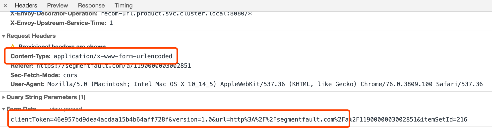
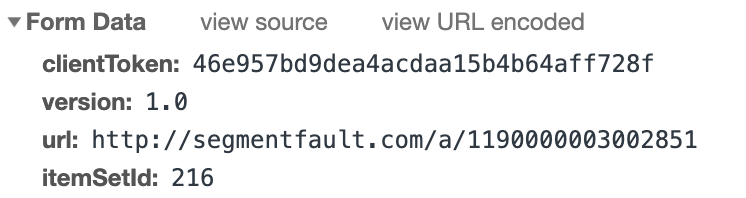
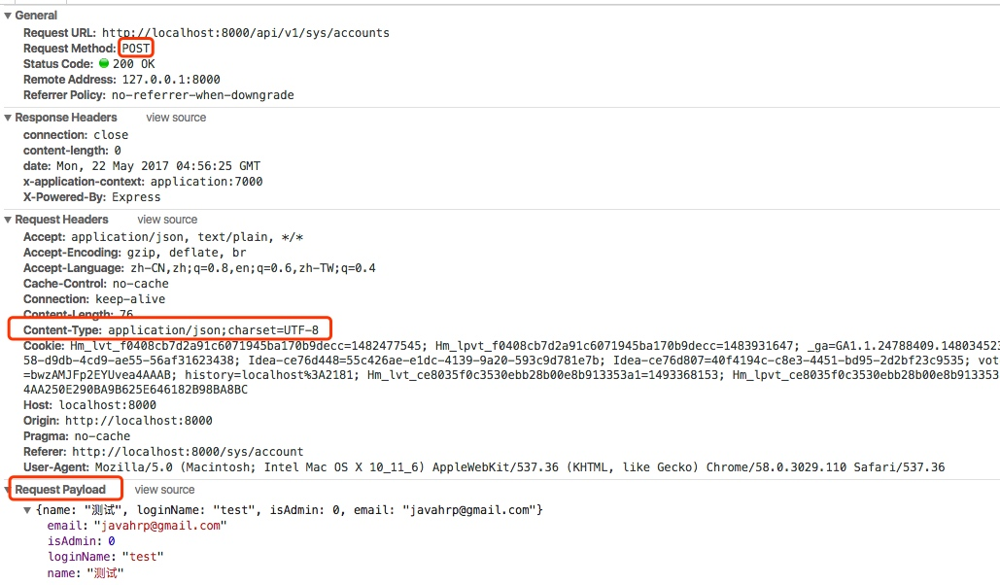

## Content-Type详解

### 1. Content-Type
`Content-Type`用于指定请求和响应的HTTP内容类型。可以显式指定，默认`text/html`。
网络请求中，常用的`Content-Type`有以下几种：
* `text/html`
* `text/plain`
* `text/css`
* `text/javascript`
* `image/jpeg`
* `image/png`
* `image/gif`
* `application/x-www-form-urlencoded`
* `multipart/form-data`
* `application/json`
* `application/xml`
* ...

其中，`text/html`、`text/plain`、`text/css`、`text/javascript`、`image/*`都是常见的页面资源类型。       
最后四种则是ajax请求，表单提交或文件上传常用的资源类型。

#### application/x-www-form-urlencoded
* 最常见的post提交数据方式
* 原生form表单默认的提交方式（可以使用`enctype`指定提交数据类型）
* jQuery、zepto等默认提交数据方式
提交的数据按照`key=value&key1=value1`形式，类似这样



在chrome的network面板下，默认请求体是被解析的，展示成FormData的形式：



#### multipart/form-data
使用表单上传文件时，必须指定表单的`enctype`属性值为`multipart/form-data`。请求体被分割成多部分，每部分使用`--boundary`分割，使用`--boundary--\r\n`结束。
```html
<form action="/upload" enctype="multipart/form-data" method="post">
    用户名: <input type="text" name="username">
    密码: <input type="password" name="password">
    上传文件: <input type="file" name="file">
    <input type="submit" value="提交">
</form>
```
TODO: 待验证

#### application/json
以json格式提交数据，可能需要后端支持，请求体类似这样：
```
POST http://www.example.com HTTP/1.1 
Content-Type: application/json;charset=utf-8

{"title":"test","sub":[1,2,3]}
```
这chrome的network面板中，json格式提交的数据会显示成`Request payload`:



axios默认post提交方式就是`application/json`，所以在axios提交表单时需要注意后端能不能解析，不能解析需要设置post常用格式`application/x-www-form-urlencoded`，且提交的数据需要使用`qs`模块序列化成`title=test&sub=[1,2,3]`的格式，这部分功能可以在axios的拦截器中设置：
```js
axios.interceptors.request.use(config => {
    if(config.method === 'post'){
        config.data = qs.stringify(config.data);
        config.headers['Content-Type'] = 'application/x-www-form-urlencoded';
    }
    return config;
}, function(err){});
```

#### application/xml
TODO: 待验证
以xml格式提交提交数据，微信的请求就使用的这种格式，请求头如下：
```xml
POST http://www.example.com HTTP/1.1 
Content-Type: text/xml

<?xml version="1.0"?>
<resource>
    <id>123</id>
    <params>
        <name>
            <value>example</value>
        </name>
        <age>
            <value>21</value>
        </age>
    </params>
</resource>
```

### 2. 引用

[NodeList（MDN）](https://developer.mozilla.org/zh-CN/docs/Web/API/NodeList)