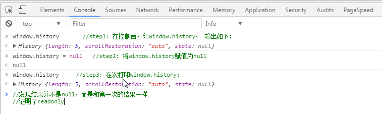
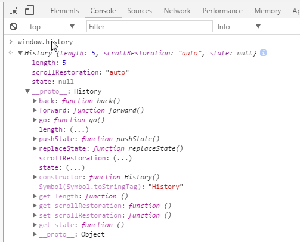
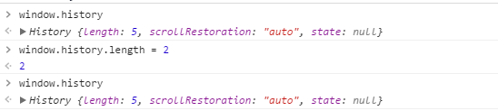

### HistoryApi及不刷新页面的情况下改变URL实践

#### 1. window.history基础详解
1. history实例



2. 操作session级别的url

    history内部有一个栈，当然这个栈是不可见的（处于安全考虑）。这个栈用来存放当前浏览器session级别的（关闭前）同一个tab所有访问过的url

    

    history对象并没有暴露存放历史url的属性。所以我们并不能通过类似如下方法操作会话历史：
    ```
    window.history.urlList = "http://www.***.com"
    ```

    可通过以下属性和方法来操作浏览器的会话历史

    1. length属性：记录进入会话历史的url的数目，注意是readonly!

        

    2. back，forward方法：调用次方法相当于点击浏览器的后退和前进按钮（此方法忽视一切参数）

    3. go方法：可加载历史列表中的某个具体的页面

    4. state: 一个与指定网址相关的状态对象，popstate事件触发时，该对象会传入回调函数。只读属性，不能直接修改，可以通过pushSate和replaceState操作

    5. **pushState 在history栈中添加一个新的记录。**
        ```js
        window.history.pushstatus(state, title, url)
        ```
        依次接受三个参数：

        1. `state`: 一个与添加的记录相关联的状态对象，主要用于popstate事件。该事件触发时，该对象会传入回调函数。也就是说，浏览器会将这个对象序列化以后保留在本地，重新载入这个页面的时候，可以拿到这个对象。如果不需要这个对象，此处可以填`null`

        2. 新页面的标题。但是，现在所有浏览器都忽视这个参数，所以这里可以填`null`

        3. 新的网址，必须与当前页面处在同一个域。浏览器的地址栏将显示这个网址。

        `pushState()`方法不会触发页面刷新，只是导致 History 对象发生变化，地址栏会有反应

        如果pushState的 URL 参数设置了一个新的锚点值（即hash），并不会触发hashchange事件。反过来，如果 URL 的锚点值变了，则会在 History 对象创建一条浏览记录
        ```js
        history.pushState({foo: 'bar'}, 'page title', 'test.html#aink');
        ```

        如果pushState()方法设置了一个跨域网址，则会报错。
        ```js
        history.pushState(null, '', 'https://twitter.com/hello');
        ```
        pushState想要插入一个跨域的网址，导致报错。这样设计的目的是，防止恶意代码让用户以为他们是在另一个网站上，因为这个方法不会导致页面跳转。

    6. **replaceState 在history栈中替换当前记录，其他和pushState一样**

    7. popstate 事件

        每当同一个文档的浏览历史（即history对象）出现变化时，就会触发`popstate`事件。

        注意，仅仅调用`pushState()`方法或`replaceState()`方法 ，并不会触发该事件.

        ```js
        // 可以为popstate事件指定回调函数
        window.onpopstate = function (event) {
            console.log('state: ' + JSON.stringify(event.state));
        };
        ```

    8. **ScrollRestoration**: 前进后退时滚动条的位置。可修改属性，属性值：

        auto: 默认，保留上一次的滚动条位置。        
        manual： 滚动条位置为初始化位置（垂直方向置顶，水平方向最左边）
    
#### 2. 不刷新页面的情况下改变URL实践


#### 3. 引用
[window.history详解](https://my.oschina.net/u/3303095/blog/1083136)

[History 对象（阮一峰）](https://wangdoc.com/javascript/bom/history.html)

[History API与浏览器历史堆栈管理](https://www.cnblogs.com/accordion/p/5699372.html)