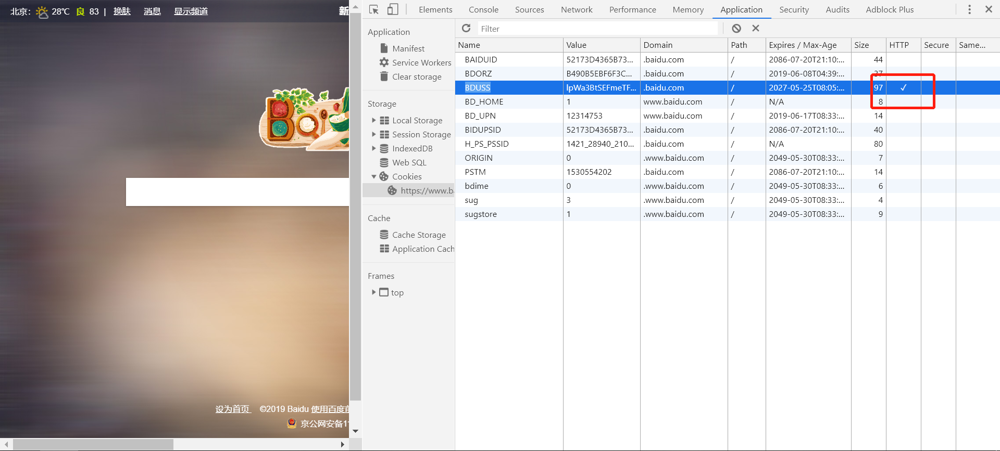

### Js操作Cookie，以及HttpOnly的限制

#### 1. HttpOnly

HttpOnly是包含在Set-Cookie HTTP响应头文件中的附加标志。生成cookie时使用HttpOnly标志有助于降低客户端脚本访问受保护cookie的风险（如果浏览器支持）。

如果某一个Cookie 选项被设置成 HttpOnly = true 的话，那此Cookie 只能通过服务器端修改，Js 是操作不了的，对于 document.cookie 来说是透明的。

#### 2. 应用
在浏览器中的表现就是，在控制台cookie的http这一栏，对应字段后有一个√标记。在前端代码中，该条cookie无法通过js获取或者删除。

