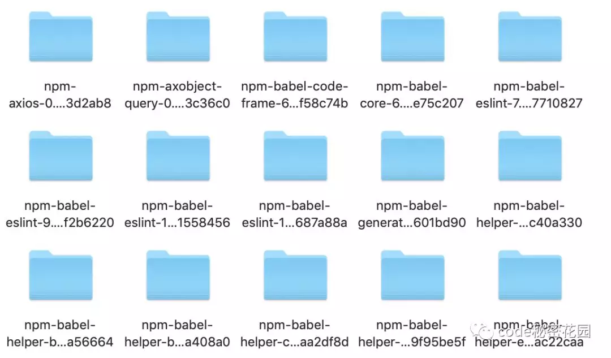

## npm详解

### 一. npm init
初始化一个简单的`package.json`文件，执行该命令后终端会依次询问`name,version,description`等字段。

#### 1. npm init 执行默认行为
`--yes`参数，可以免去一直按`enter`
```sh
npm init --yes
```

#### 2. 自定义 npm init 行为
`npm init`命令的原理并不复杂，调用脚本，输出一个初始化的`package.json`文件。所以相应的，定制`npm init`命令的实现方式也很简单。在`Home`目录创建一个`.npm-init.js`即可，该文件的`module.exports`即为`package.json`的配置内容，需要获取用户输入的时候，使用`prompt()`即可。
```js
// ~/.npm-init.js
const desc = prompt('description?', 'A new package...')
const bar = prompt('bar?', '')
const count = prompt('count?', '42')

module.exports = {
    key: 'value',
    foo: {
        bar: bar,
        count: count
    },
    name: prompt('name?', process.cwd().split('/').pop()),
    version: prompt('version?', '0.1.0'),
    description: desc,
    main: 'index.js',
}
```
此时在`~/hello`目录下执行`npm init`将会得到这样的`package.json`：
```json
{
    "key": "value",
    "foo": {
        "bar": "",
        "count": "42"
    },
    "name": "hello",
    "version": "0.1.0",
    "description": "A new package...",
    "main": "index.js"
}
```
除了生成`package.json`，因为`.npm-init.js`是一个常规的模块意味着我们可以执行随便什么`node`脚本可以执行的任务。例如通过`fs`创建`README`，`.eslintrc`等项目必须文件，实现项目脚手架的制作。

### 二. 依赖包安装
依赖管理是npm的核心功能，原理就是执行npm install从package.json中的dependencies，devDependencies将依赖包安装到当前目录的./node_modules文件夹中。

#### 1. package定义
`npm install <package>`命令的第三个参数通常是指我们要安装的包名，默认配置下会从默认的源（`Registry`）中查找该包名对应的包地址，并下载安装。除此之外，`package`还可以是一个指向有效包名的`http url/git url/文件夹路径`。  
只要符合以下 a)到 g)其中之一条件，就是一个`package`：  
| # | 说明 | 例子 |
|:- |:- |:- |
| a) | 一个包含了程序和描述该程序的`package.json`文件的文件夹 | `./local-module/` |
| b) | 一个包含了(a)的`gzip`压缩文件 | `./module.tar.gz` |
| c) | 一个可以下载得到(b)资源的`url`（通常是`http(s)url`） | `https://registry.npmjs.org/webpack/-/webpack-4.1.0.tgz` |
| d) | 一个格式为`<name>@<version>`的字符串，可指向`npm`源（通常是官方源`npmjs.org`）上已发布可访问`url`，且改`url`满足条件(c) | `webpack@4.0.1` |
| e) | 一个格式为`<name>@<tag>`的字符串，在`npm`源上该`<tag>`指向某`<version>`得到`<name>@<version>`，后者满足条件(d) | `webpack@latest` |
| f) | 一个格式为`<name>`的字符串，默认添加latest标签所得到的`<name>@latest`满足条件(e) | `webpack` |
| g) | 一个`git url`，该`url`指向的代码库满足条件(a) | `git@github.com:webpack/webpack.git` |

#### 2. 安装本地包/远程git仓库包
在共享依赖包时，并不是非要将包发表到`npm`源上才可以提供给使用者来安装。这对于私有的不方便`publish`到远程源（即使是私有源），或者需要对某官方源进行改造，但依然需要把包共享出去的场景来说 非常实用。

1. **场景1：本地模块引用**  
    `nodejs`应用开发中不可避免有模块间调用，例如在实践中经常会把需要被频繁引用的的配置模块放到应用根目录；于是在创建了很多层级的目录、文件后，很可能会遇到这样的代码：  
    ```js
    const config = require('../../../config.js');
    ```
    除了看上去很丑以外，这样的路径引用也不利于代码重构。并且身为程序员的自我修养告诉我们，这样重复的代码多了也就意味着是时候把这个模块分离出来供应用内其他的模块共享了。例如这个例子里的`config.js`非常适合封装为`package`放到`node_modules`目录下，共享给同应用内其他模块。  
    无需手动拷贝文件或者创建软连接到`node_modules`目录，`npm`有更优雅的解决方案。  
    1. 创建`config`包：新增`config`文件夹；重命名`config.js`为`config/index.js`文件；创建`package.json`定义`config`包；  
        ```json
        {
            "name": "config",
            "main": "index.js",
            "version": "0.1.0"
        }
        ```
    2. 在应用层`package.json`文件中新增依赖项，然后执行`npm install`；或者直接执行第3步。  
        ```json
        {
            "dependencies": {
                "config": "file:../config"
            }
        }
        ```
    3. （等价于第2步）直接在应用目录执行`npm install file:../config ` 

    此时，查看`node_modules`目录我们会发现多出来一个名为`config`，指向上层`config/`文件夹的软连接。这是因为`npm`识别`file:`协议的`url`，得知这个包需要直接从文件系统中获取，自动创建软连接到`node_modules`中，完成安装过程。  
    相比手动软连，我们既不需要关心`windows`和`linux`命令差异，又可以显式地将依赖信息固化到`dependencies`字段中，可发团队其他成员可以执行`npm install`后直接使用。

2. **场景2：私有 git 共享 package**  
    有些时候，我们一个团队内会有一些代码/公共库需要在团队内不同项目间共享，但可能由于包含了敏感内容，或者代码太烂拿不出手等原因，不方便发布到源。  
    这种情况下，我们可以简单地将被依赖的包托管在私有的`git`仓库中，然后将该`git url`保存到`dependencies`中，`npm`会直接调用系统的`git`命令从`git`仓库拉取包的内容到`node_modules`中。  
    ```sh
    <protocol>://[<user>[:<password>]@]<hostname>[:<port>][/][path][#<commit-ish> | #semver:<semver>]
    ```
    `git`路径后可以使用`#`指定特定的`git branch/commit/tag`，也可以`#semver:`指定特定的`semver range`。
    ```sh
    git+ssh://git@github.com:npm/npm.git#v1.0.27
    git+ssh://git@github.com:npm/npm#semver:^5.0
    git+https://isaacs@github.com/npm/npm.git
    git://github.com/npm/npm.git#v1.0.27
    ```

3. **场景3：开源 package 问题修复**  
    使用某个`npm`包时发现它有某个严重`bug`，但也许最初作者已不再维护代码了，也许工作紧急，没有足够时间提`issue`，再等待`npm`源的修复版本更新。  
    此时，手动修改`node_modules`下的代码是不明智的。首先，`node_modules`本身不应该放进版本控制系统，因此修改不会被记进`git`提交记录；其次就算非要反模式，把`node_modules`放进版本控制中，你的修改内容也很容易在下次team中某位成员执行`npm install`或`npm update`时被覆盖，而这样的一次提交很可能包含了几十几百个包的更新，你自己所做的修改很容易就被淹没在庞大的`diff`文件列表中了。  
    **最好的办法应该是：**`fork`原作者的`git`库，在自己所属的`repo`下修复问题后，将`dependencies`中相应的依赖项更改为自己修复后版本的`git url`即可解决问题。（`fork`代码库后，也便于向原作者提交`PR`修复问题。上游代码库修复问题后，再次更新我们的依赖配置也不迟。）

### 三. npm install 原理
#### 1. npm的不同版本差异
我们假设应用目录为`app`，用两个流行的包`webpack`，`nconf`作为依赖包做示例说明。并且为了正常安装，使用了“上古”`npm2`时期的版本，`webpack@1.15.0`，`ncof@0.8.5`。

1. **npm2**  
    `npm2`在安装依赖包时，采用简单的递归安装方法。执行`npm install`后，`npm2`依次递归安装`webpack`和`nconf`两个包到`node_modules`中。执行完毕后，我们会看到`./node_modules`这层目录只含有这两个子目录。
    ```sh
    node_modules/
    ├── nconf/
    └── webpack/
    ```
    进入更深一层`webpack`或`nconf`目录，将看到这两个包各自的`node_modules`中，已经由npm递归安装好自身的依赖包。包括`./node_modules/webpack`，`/node_modules/webpack-core`，`./node_modules/conf`，`/node_modules/async`等。而每一个包都有自己的依赖包，每个包自己的依赖都安装在了自己的`node_modules`中。依赖关系层层递进，构成一整个依赖树，这个依赖树与文件系统中的文件结构树刚好层层对应。
    ```sh
    ## app 目录下执行 npm ls命令
    app@0.1.0
    ├─┬ nconf@0.8.5
    │ ├── async@1.5.2
    │ ├── ini@1.3.5
    │ ├── secure-keys@1.0.0
    │ └── yargs@3.32.0
    └─┬ webpack@1.15.0
      ├── acorn@3.3.0
      ├── async@1.5.2
      ├── clone@1.0.3
      ├── ...
      ├── optimist@0.6.1
      ├── supports-color@3.2.3
      ├── tapable@0.1.10
      ├── uglify-js@2.7.5
      ├── watchpack@0.2.9
      └─┬ webpack-core@0.6.9
        ├── source-list-map@0.1.8
        └── source-map@0.4.4
    ```
    **优点：**
    1. 层级结构明显，便于进行傻瓜式的管理。例如新装一个依赖包，可以立即在第一层`node_modules`中看到子目录。  
    2. 在已知所需包名和版本号时，甚至可以从别的文件夹手动拷贝需要的包到`node_modules`文件夹中，再手动修改`package.json`中的依赖配置  
    3. 要删除这个包，也可以简单地手动删除这个包的子目录，并删除`package.json`中相应的一行即可  

    **缺点：**
    1. 对于复杂的工程，`node_modules`内目录结构可能会太深，导致深层的文件路径过长而触发`windows`文件系统中，文件路径不能超过260个字符长的错误  
    2. 部分被多个包所依赖的包，很可能在应用`node_modules`目录中的很多地方被重复安装。随着工程规模越来越大，依赖树越来越复杂，这样的包情况会越来越多，造成大量的冗余  
        在我们的示例中就有这个问题，`webpack`和`nconf`都依赖`async`这个包，所以在文件系统中，`webpack`和`nconf`的`node_modules`子目录中都安装了相同的`async`包，并且是相同的版本。  
        ```
        +-------------------------------------------+
        |                   app/                    |
        +----------+------------------------+-------+
                   |                        |
                   |                        |
        +----------v------+       +---------v-------+
        |                 |       |                 |
        |  webpack@1.15.0 |       |  nconf@0.8.5    |
        |                 |       |                 |
        +--------+--------+       +--------+--------+
                 |                         |
           +-----v-----+             +-----v-----+
           |async@1.5.2|             |async@1.5.2|
           +-----------+             +-----------+
        ```

2. **npm3 - 扁平结构**  
    主要为了解决以上问题，`npm3`的`node_moudles`目录改成了更加扁平状的层级结构。文件系统中`webpack，nconf，async`的层级关系变成了平级关系，处于同一目录中。  
    ```
             +-------------------------------------------+
             |                   app/                    |
             +-+---------------------------------------+-+
               |                                       |
               |                                       |
    +----------v------+    +-------------+   +---------v-------+
    |                 |    |             |   |                 |
    |  webpack@1.15.0 |    | async@1.5.2 |   |  nconf@0.8.5    |
    |                 |    |             |   |                 |
    +-----------------+    +-------------+   +-----------------+
    ```
    虽然这样一来`webpack/node_modules`和`nconf/node_modules`中都不再有`async`文件夹，但得益于`node`的模块加载机制，它们都可以在上一级`node_modules`目录中找到`async`库。所以`webpack`和`nconf`的代码中`require('async')`语句的执行都不会有任何问题。  
    这只是最简单的例子，实际的工程项目中，依赖树不可避免地会有很多层级，很多依赖包，其中会有很多同名但版本不同的包存在于不同的依赖层级，对这些复杂的情况，`npm3`都会在安装时遍历整个依赖树，计算出最合理的文件夹安装方式，使得所有被重复依赖的包都可以去重安装。  
    > 假如`package{dev}`写法代表包和包的依赖，那么`A{B,C}，B{C}，C{D}`的依赖结构在安装之后的`node_modules`是这样的结构：
    ```
    A
    +-- B
    +-- C
    +-- D
    ```
    这里之所以`D`也安装到了与`BC`同一级目录，是因为`npm`会默认在无冲突的前提下，**尽可能将包安装到较高的层级**。
    > `A{B,C}, B{C,D@1}, C{D@2}` 的依赖关系，得到的安装结构是：
    ```
    A
    +-- B
    +-- C
      `-- D@2
    +-- D@1
    ```
    这里是因为，对于`npm`来说同名但不同版本的包是两个独立的包，而同层不能有两个同名子目录，所以其中的`D@2`放到了`C`的子目录，而另一个`D@1`被放到了再上一层目录。  
    很明显在`npm3`之后`npm`的依赖树结构不再与文件夹层级一一对应了。
    > PS:与本地依赖包不同，如果我们通过`npm install --global`全局安装包到全局目录时，得到的目录依然是”传统的“目录结构。而如果使用npm3想要得到”传统“形式的本地`node_modules`目录，使用`npm install --global-style`命令即可。

3. **npm5 package-lock文件**  
    npm5依然沿用npm3扁平化的依赖包安装方式，此外最大的变化就是增加了`package-lock.json`文件。 
    `package-lock.json`的作用是锁定依赖安装结构，它的`json`结构，与`node_modules`目录的文件层级结构是一一对应的。  
    以依赖关系为：`app{webpack}`的`app`项目为例，其`package-lock`文件包含了这样的片段。  
    ```json
    {
        "name": "app",
        "version": "0.1.0",
        "lockfileVersion": 1,
        "requires": true,
        "dependencies": {
            // ... 其他依赖包
            "webpack": {
                "version": "1.8.11",
                "resolved": "https://registry.npmjs.org/webpack/-/webpack-1.8.11.tgz",
                "integrity": "sha1-Yu0hnstBy/qcKuanu6laSYtgkcI=",
                "requires": {
                    "async": "0.9.2",
                    "clone": "0.1.19",
                    "enhanced-resolve": "0.8.6",
                    "esprima": "1.2.5",
                    "interpret": "0.5.2",
                    "memory-fs": "0.2.0",
                    "mkdirp": "0.5.1",
                    "node-libs-browser": "0.4.3",
                    "optimist": "0.6.1",
                    "supports-color": "1.3.1",
                    "tapable": "0.1.10",
                    "uglify-js": "2.4.24",
                    "watchpack": "0.2.9",
                    "webpack-core": "0.6.9"
                }
            },
            "webpack-core": {
                "version": "0.6.9",
                "resolved": "https://registry.npmjs.org/webpack-core/-/webpack-core-0.6.9.tgz",
                "integrity": "sha1-/FcViMhVjad76e+23r3Fo7FyvcI=",
                "requires": {
                    "source-list-map": "0.1.8",
                    "source-map": "0.4.4"
                },
                "dependencies": {
                    "source-map": {
                        "version": "0.4.4",
                        "resolved": "https://registry.npmjs.org/source-map/-/source-map-0.4.4.tgz",
                        "integrity": "sha1-66T12pwNyZneaAMti092FzZSA2s=",
                        "requires": {
                            "amdefine": "1.0.1"
                        }
                    }
                }
            },
            //... 其他依赖包
        }
    }
    ```
    * `version`，`resolved`，`integrity`用来记录包的准确版本号、安装源、内容`hash`的，决定了要安装包的准确“身份”信息  
    * 只关注文件中的`dependencies: {}`会发现，整个文件的`JSON`配置里的`dependencies`层次结构与文件系统中`node_modules`的文件层次结构是完全对照的  
    * 只关注`requires:{}`字段又会发现，除最外层的`requires`属性为`true`外，其它层的`requires`属性都对应着这个包的`package.json`里记录的自己的依赖项  

    因为这个文件记录了`node_modules`里所有包的结构、层级和版本号甚至安装源，它也就事实上提供了”保存“`node_modules`状态的能力。只要有这样一个`lock`文件，不管在哪一台机器上执行`npm install`都会得到完全相同的`node_modules`结果。  
    这就是`package-lock`致力于优化的场景：在从前仅仅依赖`package.json`记录依赖，由于`semver range`的机制，一个月前由`A`生成的`package.json`文件，`B`在一个月后根据它执行`npm install`所得到的`node_modules`结果很可能许多包都存在不同的差异，虽然`semver`机制的限制使得同一份`package.json`不会得到大版本不同的依赖包，但同一份代码在不同环境安装出不同的依赖包，依然是可能导致意外的潜在因素。  
    相同作用的文件在`npm5`之前就有，`npm shrinkwrap`文件，二者作用完全相同，不同的是后者需要手动生成，而`npm5`默认会在执行`npm install`后就生成`package-lock`文件，并且建议你提交到`git/svn`代码库中。  
    在`npm5.0`中，如果已有`package-lock`文件存在，若手动在`package.json`文件新增一条依赖，再执行`npm install`，新增的依赖并不会被安装到`node_modules`中，`package-lock.json`也不会做响应的更新。**所以不要使用`npm5.0`！**
    ```sh
    # 禁用package-lock配置
    npm config set package-lock false
    ```

#### 2. 【原理分析】


1. **安装流程**  
    * 检查`.npmrc`文件，优先级为：项目级的`.npmrc`文件 > 用户级的`.npmrc`文件 > 全局的`.npmrc`文件 > npm内置的`.npmrc`文件  
    * 检查项目中有无`lock`文件
    * 无`lock`文件
        * 从远程`npm`仓库获取包信息
        * 根据`package.json`构建依赖树，构建过程：
            * 构建依赖树时，不管其是直接依赖还是子依赖的依赖，优先将其放置到`node_modules`根目录。
            * 当遇到相同模块时，判断已放置在依赖树的模块版本是否符合新模块的版本范围，如果符合则跳过，不符合则在当前模块的`node_modules`下放置该模块。
            注意这一步只是确定逻辑上的依赖树，并非真正的安装，后面会根据这个依赖结构去下载或拿到缓存中的依赖包。
        * 在缓存中依次查找依赖树中的每个包
            * 不存在缓存
                * 从`npm`远程仓库下载包
                * 检验包的完整性
                * 检验通过
                    * 将下载的包复制到`npm`缓存目录
                    * 将下载的包按照依赖结构解压到`node_modules`
                * 检验不通过
                    * 重新下载
            * 存在缓存：将缓存按照依赖结构解压到`node_modules`
        * 将包解压到`node_modules`
        * 生成`lock`文件
    * 有`lock`文件
        * 检查`package.json`中的依赖版本是否和`package-lock.json`中的依赖有冲突
        * 如果没有冲突，直接跳过获取包信息、构建依赖树过程，开始在缓存中查找包信息，后续过程相同

执行`npm install package --timing=true --loglevel=verbose`来查看某个包具体啊安装流程和细节。

1. `package-lock`中已经缓存了每个包的具体版本和下载链接，不需要再去远程仓库进行查询，然后直接进入文件完整性校验环节，减少了大量网络请求。因此，使用`package-lock.json`可以显著加速依赖安装时间。

### 四. 依赖包版本管理
#### 1. semver  
`npm`依赖管理的一个重要特性是采用了 **语义化版本(`semver`)** 规范，作为依赖版本管理方案。  
`semver`约定了一个包的版本号必须包含三个数字，格式必须为`MAJOR.MINOR.PATCH`，意为`主版本号.小版本号.修订版本号`。  
* `MAJOR`：对应大的版本号迭代，做了不兼容旧版的修改时要更新`MAJOR`版本号  
* `MINOR`：对应小版本迭代，发生兼容旧版本api的修改或功能更新时，更新`MINOR`版本号  
* `PATCH`：对应修订版本号，一般针对修复`bug`的版本号  

对于包作者（发布者），`npm`要求在`publish`之前，必须更新版本号。`npm`提供了`npm version`工具，执行`npm version major|minor|patch`可以简单地将版本号中相应的数字加`1`。  
> 如果包是一个`git`仓库，`npm version`还会自动创建一条注释为更新后版本号的`commit`和名该版本号的`tag`

对于包的引用者来说，我们需要在`dependencies`中使用`semver`约定的`semver range`指定所需依赖包的版本号或版本范围（[semver规则](https://semver.npmjs.com)）。常用规则示例如下：  
| range | 含义 | 例子 |
|:- |:- |:- |
| `^2.2.1` | 指定的`MAJOR`版本号下，所有更新的版本 | 匹配`2.2.3`，`2.3.0`；不匹配`1.0.3`，`3.0.1`
| `~2.2.1` | 指定`MAJOR.MINOR`版本号下，所有更新的版本 | 匹配`2.2.3`，`2.2.9`；不匹配`2.3.0`，`2.4.5`
| `>=2.1` | 版本号大于或等于`2.1.0` | 匹配`2.1.2`，`3.1`
| `<=2.2` | 版本号小于或等于`2.2` | 匹配`1.0.0`，`2.2.1`，`2.2.11` 
| `1.0.0 - 2.0.0` | 版本号从`1.0.0`（含）到`2.0.0`（含） | 匹配`1.0.0`，`1.3.4`，`2.0.0`
* 任意两条规则，用空格连接起来，表示`“与”`逻辑：  
    如：`>=2.3.1 <=2.8.0` 可以解读为：`>=2.3.1` 且 `<=2.8.0`  
* 任意两条规则，通过||连接起来，表示`“或”`逻辑，即两条规则的并集：
    如：`^2 >=2.3.1 || ^3 >=3.2`  
    可以匹配：`2.3.1`，`2.8.1`，`3.3.1`  
    但不匹配：`1.0.0`，`2.2.0`，`3.1.0`，`4.0.0`  
* **PS：** 除了这几种，还有如下更直观地表示版本号范围的写法：  
    * `*`或`x`匹配 所有主版本
    * `1`或`1.x`匹配 主版本号为`1`的所有版本
    * `1.2`或`1.2.x`匹配 版本号为`1.2`开头的所有版本
* **PPS：** 在常规仅包含数字的版本号之外，`semver`还允许在`MAJOR.MINOR.PATCH`后追加-后跟点号分割的标签，作为预发布版本标签 `-Prerelese Tags`，通常被视为不稳定、不建议生产使用的版本。例如：
    * `1.0.0-alpha`
    * `1.0.0-beta.1`
    * `1.0.0-rc.3`

上表中我们最常见的是`^1.8.11`这种格式的`range`，因为我们在使用`npm install <packagename>`安装包时，**`npm`默认安装当前最新版本**，例如`1.8.11`，然后在所安装的版本号前加`^`号，将`^1.8.11`写入`package.json`依赖配置，意味着可以匹配`1.8.11`以上，`2.0.0`以下的所有版本。  

#### 2. 依赖版本升级  
使用`npm install`或`npm update`可以升级依赖包版本，但在不同的`npm`版本，不同的`package.json`，`package-lock.json`，安装/升级的表现也不同。  
以`webpack`为例，做如下前提假设：
* 我们的工程项目`app`依然依赖`webpack`
* 项目最初始化时，安装了当时最新的包`webpack@1.8.0`，并且`package.json`中的依赖配置为：`"webpack": "^1.8.0"`
* 当前（2018年3月）`webpack`最新版本为`4.2.0`，`webpack1.x`最新子版本为`1.15.0`

1. **如果我们使用npm3并且项目不含`package-lock.json`，有如下结论：**  
    * 如果本地`node_modules`已安装，再次执行`install`不会更新包版本，执行`update`才会更新；而如果本地`node_modules`为空时，执行`install/update`都会直接安装更新包。  
    * `npm update`总是会把包更新到符合`package.json`中指定的`semver`的最新版本号——本例中符合`^1.8.0`的最新版本为`1.15.0`  
    * 一旦给定`package.json`，无论后面执行`install`还是`update`，`package.json`中的`webpack`版本一直顽固的保持一开始的`^1.8.0`岿然不动  

    这里不合理的地方在于，如果最开始团队中的第一个人安装了`webpack@1.8.0`，而新加入项目的成员`checkout`工程代码后`npm install`会安装得到不太一样的`1.15.0`版本。虽然`semver`约定了小版本号应当保持向下兼容（相同大版本号下的小版本号兼容），但万一有不熟悉不遵守此约定的包发布者，发布了不兼容的包，此时就可能出现因依赖环境不同导致的`bug`。  

2. **`npm5`带`package-lock.json`执行效果（`node9.8.0`，`npm5.7.1`）**  
    * 无论何时执行`install`，`npm`都会优先按照`package-lock`中指定的版本来安装`webpack`；避免了`npm3`中初次安装，自动安装最新小版本的情况。  
    * 无论何时完成安装/更新，`package-lock`文件总会跟着`node_modules`更新（因此可以视`package-lock`文件为`node_modules`的`JSON`表述）  
    * 已安装`node_modules`后，若执行`update`，`package.json`中的版本号也会随之更改为`^1.15.0`  

    由此可见，`npm5.1`使得`package.json`和`package-lock.json`中所保存的版本号更加统一，解决`npm`之前的各种问题。只要遵循好的实践习惯，团队成员可以很方便的维护一套应用代码和`node_modules`依赖都一致的环境。

#### 3. 最佳实践  
1. 使用`npm：>=5.1`版本，保持`package.json`文件默认开启配置  
2. 初始化：第一作者初始化项目时使用`npm install <package>`安装依赖包，默认保存`^X.Y.Z`依赖`range`到`package.json`中；提交`package.json`，`package-lock.json`，不要提交`node_modules`目录  
3. 初始化：项目成员首次`checkout/clone`项目，执行一次`npm install`安装依赖包  
4. 不要手动修改`package-lock.json`
5. 升级依赖包  
    * 升级小版本：`npm update`升级到最新小版本  
    * 升级大版本：执行`npm install <package-name>@<version>`升级到新的大版本  
    * 也可以手动修改`package.json`中的版本号为要升级的版本，并指定所需的semver，然后执行`npm install`  
    * 本地验证升级后新版本无问题后，提交新的`package.json`，`package-lock.json`文件  
6. 降级依赖包  
    * **正确**：`npm install <package-name>@<old-version>`验证无问题后，提交`package.json`，`package-lock.json`文件  
    * **错误**：手动修改`package.json`中版本号为更低版本的`semver`，这样修改并不会生效，因为再次执行`npm install`依然会安装`package-lock.json`中锁定的版本  
7. 删除依赖包  
    * `npm uninstall <package>`，提交`package.json`和`package-lock.json`  
    * 把要卸载的包从`package.json`中`dependencies`字段删除，然后执行`npm install`，并提交`package.json`和`package-lock.json`  
8. 任何时候有人提交了`package.json`和`package-lock.json`更新后，其他成员应在`git pull`拉取更新后，执行`npm install`安装更新后的依赖包  

### 五. npm scripts
#### 1. 基本使用
```json
{
    "scripts": {
        "echho": "echo HELLO WORLD"
    }
}
```
通过`npm run echo`来执行这段脚本，像在`shell`中执行`echo HELLO WORLD`命令一样，看到终端输出`HELLO WORLD`  
1. `npm run` 命令执行时，会把`./node_modules/.bin/`目录添加到执行环境的`PATH`变量中，因此如果某个**命令行包**未全局安装，而只安装在了当前项目的`node_modules`中，通过`npm run` 一样可以调用该命令
2. 执行`npm`脚本要传入参数，需要在命令后加`--`标明，如`npm run test -- --grep="pattern"`，可以将`--grep="pattern`参数传给`test`命令
3. `npm `提供`pre`和`post`两种钩子机制，可以定义某个脚本执行前后的执行脚本
4. 运行时变量：在`npm run` 的脚本执行环境内，可以通过环境变量的方式获取许多运行时相关信息，一下都可以通过`process.env`对象访问获得：
    * `npm_lifecycle_event` 正在运行的脚本名称
    * `npm_package_<key>` 获取当前包`package.json`中某个字段的配置值，如：`npm_package_name`获取包名
    * `npm_package_<key>_<sub-key>` `package.json`中嵌套字段属性，如：`npm_package_dependencies_webpack`可以获取到`package.json`中的`dependencies.webpack`字段的值，即`webpack`的本版号

#### 2. node_modules/.bin目录
`node_modules/.bin`目录，保存了依赖目录中所安装的可供调用的命令行包。  
何谓命令行包？例如`webpack`就属于一个命令行包。如果我们在安装`webpack`时添加`--globe`参数，就可以在终端直接输入`webpack`进行调用。但如果不加`--global`参数，我们会在`node_modules/.bin`里看到名为`webpack`的文件，终端输入`./node_modules/.bin/webpack`命令，一样可以执行。  
这是因为`webpack`在`package.json`文件中定义了`bin`字段：
```json
{
    "bin": {
        "webpack": "./bin/webpack.js"
    }
}
```
`bin`字段的配置格式为`<commond>:<file>`，即`命令名:可执行文件`。`npm`执行`install`时，会分析每个依赖包的`package.json`中的`bin`字段，并将其包含的条目安装到`./node_modules/.bin`目录中，文件名为`<commond>`。而如果是全局模式安装，则会在`npm`全局安装路径的`bin`目录下创建指向`<file>`名为`<common>`的软链。因此，`./node_modules/.bin/webpack`文件在通过命令行调用时，实际上就是在执行node `./node_modules/.bin/webpack.js`命令。
> 最佳实践：将项目依赖的命令行工具安装到项目依赖文件夹当中，然后通过`npm scripts`调用，而非全局安装。

举例而言，`webpack`作为前端工程标配的构建工具，虽然我们都习惯了全局安装并使用命令行直接调用，但不同的项目依赖的`webpack`版本可能不一样，响应的`webpack.config.js`配置文件也可能只兼容了特定版本的`webpack`。如过我们只全局安装了最新的`4.x`版本，并使用命令行调用，一个依赖`3.x`的版本可能就无法正常执行构建。  
但如果这类工具总是本地安装，我们要调用一个命令，需要手动添加`./node_modules/.bin`这个前缀，很不方便。`npm`从`5.2`开始自带了一个新的工具`npx`。

#### 3. npx
`npx <commond>`，这里的`<commond>`默认就是`./node_modules`目录中安装的可执行脚本名。例如上面本地安装好的`webpack`包，可以直接`npx webpack`执行。

1. **一键执行远程npm源的二进制包**  
    除了在`package`中执行`./node_modules/.bin`中已安装的命令，还可以直接指定未安装的二进制包名执行。例如我们在一个没有`package.json`也没有`node_modules`的目录下，执行：
    ```sh
    npx cowsay hello
    ```
    `npx`将会从`npm`源下载`cowsay`这个包（但并不安装）并执行。  
    这种用途非常适合：  
    1. 在本地简单测试或调试`npm`源上这些二进制包的功能；  
    2. 调用`create-react-app`或`yeoman`这类往往每个项目只需要使用一次的脚手架工具

2. **一键执行GitHub Gist**  
    将`package.json`和需执行的二进制脚本上传至`gist`，再运行`npx <gist url>`就可以方便地执行`gist`定义的命令。 
    ```sh
    npx https://gist.github.com/zkat/4bc19503fe9e9309e2bfaa2c58074d32
    ```

3. **使用不同版本node执行命令**  
    将`npx`与`Aria Stewart`创建的`node`包（`https://www.npmjs.com/package/node`）结合，可以实现在一行命令中使用指定版本的`node`执行命令。  
    ```sh
    npx node@4 -e "console.log(process.version)"
    npx node@6 -e "console.log(process.version)"
    # 将分别输出 v4.8.7 和 v6.13.0
    ```
    往常这种工作是由`nvm`这种`node`版本管理工具来实现的，但`npx node@4`这种方式免去`nvm`手动切换配置的步骤，更加简洁简单。（但亲测比起`nvm`，实在慢得要死，不知道是不是我使用的姿势不对）

### 六. npm 配置
1. **`npm config`**  
    `npm cli`提供了`npm config`命令进行`npm`相关配置，通过`npm config ls -l`可查看`npm`的所有配置，包括默认配置。  
    修改配置的命令为`npm set config <key> <value>`，常见相关配置：
    * **proxy，https-proxy**：指定`npm`代理的地址
    * `registry`指定`npm`下载安装包时的源，默认为`https://registry.npmjs.org/`，可以指定为私有的`Registry`源。  
            例如淘宝镜像：`npm config set registry https://registry.npm.taobao.org`
    * `package-lock`，指定是否默认生成`pakcage-lock`文件，建议默认保持`true`
    * `sava true/false`指定是否在`npm install`后保存包为`dependencies`，`npm5`起默认为`true`

    删除指定的配置项命令为`npm config delete <key>`

2. **`npmrc`文件**  
    除了使用`CLI`的`npm config`命令显示更改`npm`配置，还可以通过`npmrc`文件直接修改配置。  
    `npmrc`文件优先级由高到低包括：
    * 工程内配置文件：`/path/to/my/project/.npmrc`
    * 用户级配置文件：`~/.npmrc`
    * 全局配置文件：`$PREFIX/etc/npmrc`（即`npm config get globalconfig`输出的路径）
    * `npm`内置配置文件：`/path/to/npm/npmrc`

    通过这个机制，我们可以方便地在工程根目录创建一个`.npmrc`文件共享需要在团队间共享的`npm`运行相关配置。比如我们在公司内网环境下需要通过代理才可以访问`registry`源，或需访问内网的`registry`，就可以在工作项目下新增`.npmrc`文件并提交代码库。
    ```
    proxy = http://proxy.example.com/
    https-proxy = http://proxy.example.com/
    registry = http://registry.example.com/
    ```
    因为项目级`.npmrc`文件的作用域只在本项目下，所以在非本目录下，这些配置并不生效。对于使用笔记本工作的开发者，可以很好隔离公司的工作项目、在家学习研究项目两种不同的环境。  
    将这个功能与`~/.npm-init.js`配置相结合，可以将特定配置的`.npmrc`和`.gitignore`，`README`之类文件一起做到`npm init`脚手架中，进一步减少手动配置。  

3. **`node`版本约束**  
    虽然一个项目的团队都共享了相同的代码，但每个人的开发机器可能安装了不同的`node`版本，此外服务器端的也可能与本地开发机不一致。 
    * **声明**： 通过`package.json`的`engines`属性声明应用运行所需的运行时要求。例如我们项目中使用`async`，`await`特性，最低支持版本为`7.6.0`，因此指定`engines`配置为：
        ```json
        {
            "engines": {
                "node": ">=7.6.0"
            }
        }
        ```
    * **约束式**（可选）：在`npm`中以上字段仅作为建议字段使用，若要在私有项目中加强约束，需要自己写脚本钩子，读取并解析`engines`字段`semver range`并与运行时环境做对比校验并做适当提醒。

### 七. npm vs Yarn
`Yarn`是在2016年发布的，那是`npm`还处于`v3`时期，那时候还没有`package-lock.json`文件，`npm`的不稳定性、安装速度慢等缺点经常被吐槽，因此，`yarn`诞生。


上面是官网提到的`yarn`的优点。当然后来`npm`也意识到了自己的问题，进行了很多次的优化，在后面的优化中（`lock`文件、缓存、默认`-s`...），我们多多少少能看到`Yarn`的影子，可见`Yarn`的设计还是非常优秀的。  
`npm`和`Yarn`的`lock`文件有些区别：
* `package-lock.json`使用的是`json`格式，`yarn.lock`使用的是一种自定义格式
* `yarn.lock`中子依赖的版本号不是固定的，意味着单独一个`yarn.lock`确定不了`node_modules`目录结构，还需要和`package.json`文件进行配合。而`package-lock.json`只需要一个文件即可确定。

`yarn`的缓存策略看起来和`npm v5`之前的很像，每个缓存的模块被存放在独立的文件夹，文件夹名称包含了模块名称、版本号等信息。使用命令`yarn cache dir`可以查看缓存数据的目录。



### 八. npm 最佳实践
1. 使用`npm init`初始化新项目
2. 统一项目配置：需团队共享的`npm config`配置项，固化到`.npmrc`文件中
3. 统一运行环境，统一`package.json`，统一`package-lock`文件
4. 合理使用多样化的源安装依赖包：`npm install <git url>|<local file>`
5. 使用`npm >= 5.2`版本
6. 使用`npm scripts`与`npx(npm>=5.2)`脚本管理应用相关脚本

### 九. npm 范围包
范围是类似于 `npm` 模块的命名空间，以 `@` 开头
```json
{
  "name": "@scope/project-name"
}
```
使用范围包：`npm install @username/project-name --save`
```json
// package.json
{
  "dependencies": {
    "@username/project-name": "^1.0.0"
  }
}
```

### 九. 引用
[2018 年了，你还是只会 npm install 吗？](https://juejin.im/post/5ab3f77df265da2392364341#heading-14)

[npm install 原理分析](https://mp.weixin.qq.com/s/d4v4c6MM7sWepDO0PbiNLQ)

[npm scripts 使用指南（阮一峰）](http://www.ruanyifeng.com/blog/2016/10/npm_scripts.html)