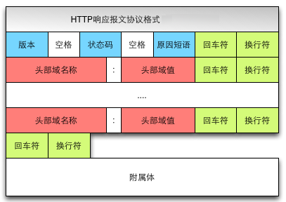
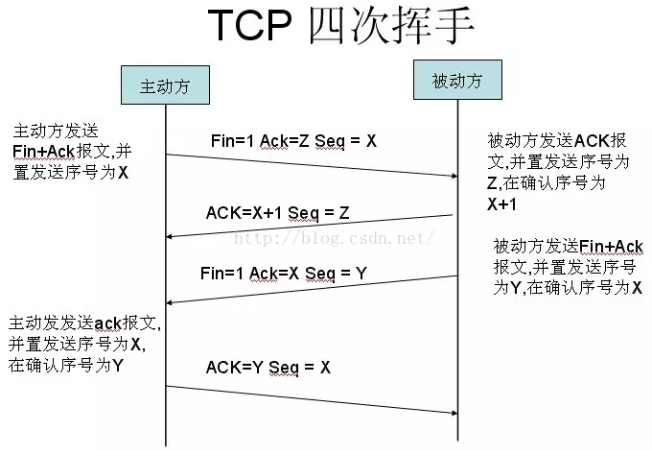

## 从URL输入到页面展现到底发生什么?

### 一. 前言


总体来说分为以下几个过程：
1. DNS解析：将域名解析为IP地址
2. TCP连接：TCP三次握手
3. 发送HTTP请求
4. 服务器处理请求并返回HTTP报文
5. 浏览器解析渲染页面
6. 断开连接：TCP四次挥手

### 二. 过程概述

#### 1. 域名解析（DNS）
浏览器并不能直接通过域名找到对应的服务器，而是要通过 IP 地址。

1. 什么是域名解析  
  DNS 协议提供通过域名查找 IP 地址，或逆向从 IP 地址反查域名的服务。DNS 是一个网络服务器，我们的域名解析简单来说就是在 DNS 上记录一条信息记录。
    ```js
    baidu.com  220.114.23.56（服务器外网IP地址）80（服务器端口号）
    ```

2. 浏览器如何通过域名去查询 URL 对应的 IP
    * 浏览器缓存：浏览器会根据一定的频率缓存DNS记录。
    * 操作系统缓存：如果浏览器缓存中找不到需要的DNS记录，就去操作系统中找。
    * 路由缓存：路由器也有DNS缓存。
    * ISP的DNS服务器：ISP是互联网服务提供商（Internet Service Provider）的简称，ISP 有专门的 DNS 服务器应对 DNS 查询请求。
    * 根服务器：ISP 的 DNS 服务器还找不到的话，它就会向根服务器发出请求，进行递归查询（DNS 服务器先问根域名服务器.com 域名服务器的 IP 地址，然后再问.baidu 域名服务器，依次类推）  
        

3. 小结
    浏览器通过向 DNS 服务器发送域名，DNS 服务器查询到与域名相对应的 IP 地址，然后返回给浏览器，浏览器再将 IP 地址打在协议上，同时请求参数也会在协议搭载，然后一并发送给对应的服务器。

#### 2. TCP三次握手
在客户端发送数据之前会发起 TCP 三次握手用以同步客户端和服务端的序列号和确认号，并交换 TCP 窗口大小信息。


1. TCP三次握手过程如下：
    * **客户端发送一个带 SYN=1，Seq=X 的数据包到服务器端口**（第一次握手，由浏览器发起，告诉服务器我要发送请求了）
    * **服务器发回一个带 SYN=1， ACK=X+1， Seq=Y 的响应包以示传达确认信息**（第二次握手，由服务器发起，告诉浏览器我准备接受了，你赶紧发送吧）
    * **客户端再回传一个带 ACK=Y+1， Seq=Z 的数据包，代表“握手结束”**（第三次握手，由浏览器发送，告诉服务器，我马上就发了，准备接受吧）

2. 为什么需要三次握手
    谢希仁著《计算机网络》中讲“三次握手”的目的是“**为了防止已失效的连接请求报文段突然又传送到了服务端，因而产生错误**”。

#### 3. 发送HTTP请求
TCP三次握手结束后，开始发送HTTP报文。


#### 4. 服务器处理请求并返回HTTP报文
1. MVC后台处理阶段
    首先浏览器发送过来的请求先经过控制器，控制器进行逻辑处理和请求分发，接着会调用模型，这一阶段模型会获取 redis db 以及 MySQL 的数据，获取数据后将渲染好的页面，响应信息会以响应报文的形式返回给客户端，最后浏览器通过渲染引擎将网页呈现在用户面前。  
        

2. HTTP响应报文
    响应报文由响应行（request line）、响应头部（header）、响应主体三个部分组成  
    

#### 5. 浏览器解析渲染页面
浏览器拿到响应文本HTML后，进入浏览器渲染阶段


浏览器解析渲染页面分为一下五个步骤：
* 根据 HTML 解析出 DOM 树
* 根据 CSS 解析生成 CSS 规则树
* 结合 DOM 树和 CSS 规则树，生成渲染树
* 根据渲染树计算每一个节点的信息
* 根据计算好的信息绘制页面

#### 6. 断开连接
当数据传输完毕，需要断开TCP连接，此时发起TCP四次挥手



* **发起方向被动方发送报文，Fin、Ack、Seq，表示已经没有数据传输了。并进入 FIN_WAIT_1 状态。**(第一次挥手：由浏览器发起的，发送给服务器，我请求报文发送完了，你准备关闭吧)
* **被动方发送报文，Ack、Seq，表示同意关闭请求。此时主机发起方进入 FIN_WAIT_2 状态。**(第二次挥手：由服务器发起的，告诉浏览器，我请求报文接受完了，我准备关闭了，你也准备吧)
* **被动方向发起方发送报文段，Fin、Ack、Seq，请求关闭连接。并进入 LAST_ACK 状态。**(第三次挥手：由服务器发起，告诉浏览器，我响应报文发送完了，你准备关闭吧)
* **发起方向被动方发送报文段，Ack、Seq。然后进入等待 TIME_WAIT 状态。被动方收到发起方的报文段以后关闭连接。发起方等待一定时间未收到回复，则正常关闭。**(第四次挥手：由浏览器发起，告诉服务器，我响应报文接受完了，我准备关闭了，你也准备吧)

### 三. 引用
[从URL输入到页面展现到底发生什么？(全网都在抄这篇，内容比较通俗易懂)](https://juejin.im/post/5bf3ad55f265da61682afc9b)

[从输入 URL 到页面加载完成的过程中都发生了什么事情？(更加底层，角度比较独特)](http://fex.baidu.com/blog/2014/05/what-happen/)